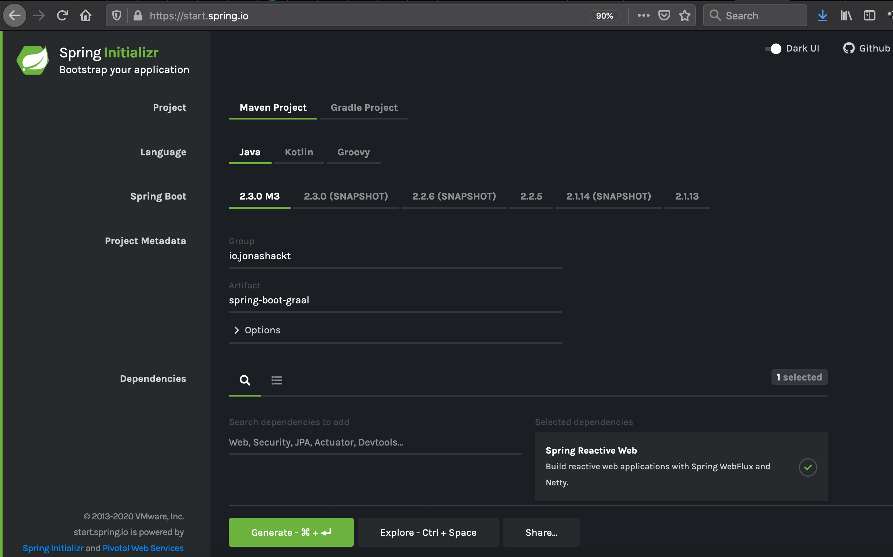
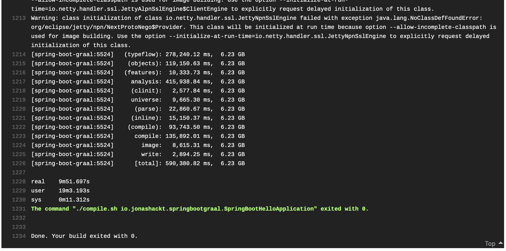
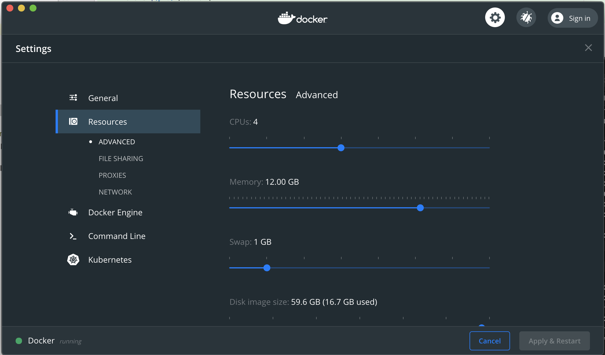
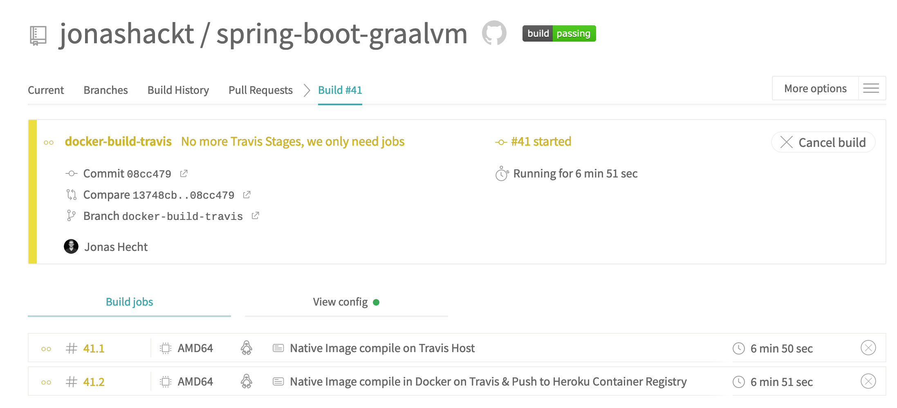
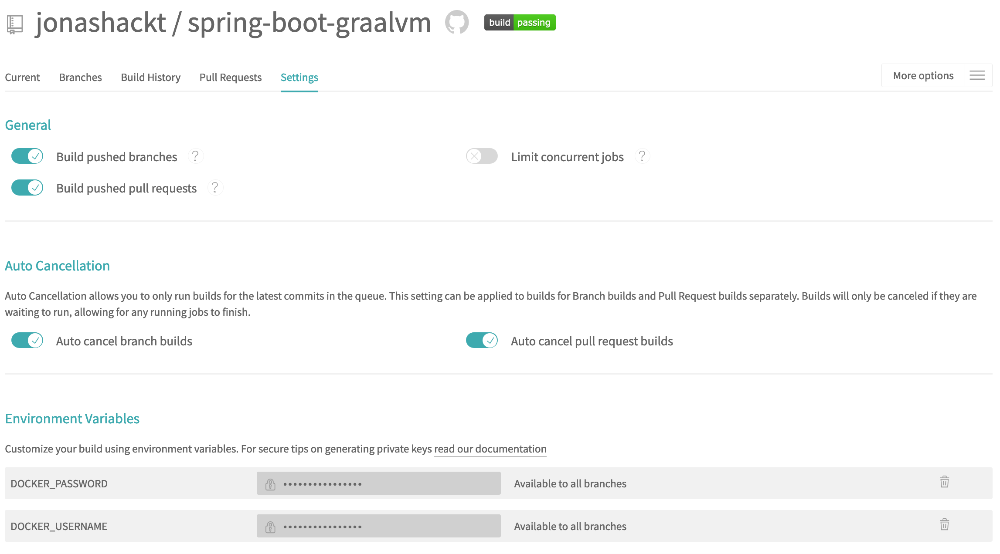
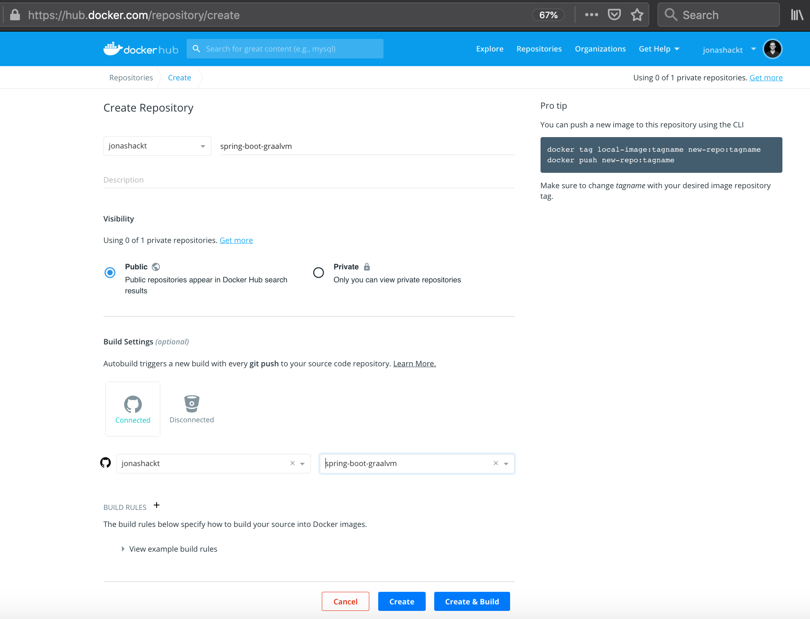

# spring-boot-graalvm
[](https://travis-ci.com/jonashackt/spring-boot-graalvm)
[](https://github.com/jonashackt/spring-boot-graalvm/blob/master/LICENSE)
[](https://renovatebot.com)
[](https://github.com/spring-projects/spring-boot)
[](https://github.com/spring-projects-experimental/spring-graalvm-native)
[](https://www.graalvm.org/)
[](https://spring-boot-graal.herokuapp.com/hello)
[](https://hub.docker.com/r/jonashackt/spring-boot-graalvm)


This example project shows how to compile a Webflux based Spring Boot application into a Native App using GraalVM Native Image

> This project here shows a technical demo of what's possible right now - stable GraalVM Native Image support for Spring Boot could be expected with [Spring Frameworks 5.3 release planned in October 2020](https://spring.io/blog/2019/12/03/spring-framework-maintenance-roadmap-in-2020-including-4-3-eol), on which Spring Boot 2.4 will be based.

[](https://asciinema.org/a/313688)

A live deployment is available on Heroku: https://spring-boot-graal.herokuapp.com/hello

This project is used as example in some articles:

* [blog.codecentric.de/en/2020/05/spring-boot-graalvm/](https://blog.codecentric.de/en/2020/05/spring-boot-graalvm/)
* [blog.codecentric.de/en/2020/06/spring-boot-graalvm-docker-heroku/](https://blog.codecentric.de/en/2020/06/spring-boot-graalvm-docker-heroku/)


## Table of Contents 

* [New to GraalVM with Spring Boot?](#new-to-graalvm-with-spring-boot)
  * [Graal Native Image & SpringBoot](#graal-native-image--springboot)
  * [Dynamic Graal Native Image configuration with @AutomaticFeature](#dynamic-graal-native-image-configuration-with-automaticfeature)
* [Install GraalVM with SDKMAN](#install-graalvm-with-sdkman)
  * [Install GraalVM Native Image](#install-graalvm-native-image)
* [Create a simple WebFlux Reactive REST Spring Boot app](#create-a-simple-webflux-reactive-rest-spring-boot-app)
* [Make Spring Boot app Graal Native Image friendly](#make-spring-boot-app-graal-native-image-friendly)
  * [Relocate Annotation classpath scanning from runtime to build time](#relocate-annotation-classpath-scanning-from-runtime-to-build-time)
  * [Disable usage of GCLIB proxies](#disable-usage-of-gclib-proxies)
  * [Detect Autoconfiguration](#detect-autoconfiguration)
  * [Get Spring Graal @AutomaticFeature](#get-spring-graal-automaticfeature)
  * [Set start-class element in pom.xml](#set-start-class-element-in-pomxml)
  * [Craft a compile.sh script](#craft-a-compilesh-script)
  * [Run the compile.sh script & start your native Spring Boot App](#run-the-compilesh-script--start-your-native-spring-boot-app)
* [Doing all the steps together using the native-image-maven-plugin](#doing-all-the-steps-together-using-the-native-image-maven-plugin)
  * [Tackling the 'No default constructor found Failed to instantiate java.lang.NoSuchMethodException: io.jonashackt.springbootgraal.SpringBootHelloApplication.()' error](#tackling-the-no-default-constructor-found-failed-to-instantiate-javalangnosuchmethodexception-iojonashacktspringbootgraalspringboothelloapplication-error)
* [Comparing Startup time & Memory footprint](#comparing-startup-time--memory-footprint)
* [Build and Run your Native Image compilation on a Cloud-CI provider like TravisCI](#build-and-run-your-native-image-compilation-on-a-cloud-ci-provider-like-travisci)
  * [Prevent the 'java.lang.UnsatisfiedLinkError: no netty_transport_native_epoll_x86_64 in java.library.path: [/usr/java/packages/lib, /usr/lib64, /lib64, /lib, /usr/lib]' error](#prevent-the-javalangunsatisfiedlinkerror-no-netty_transport_native_epoll_x86_64-in-javalibrarypath-usrjavapackageslib-usrlib64-lib64-lib-usrlib-error)
  * [Tackling the 'There was an error linking the native image /usr/bin/ld: final link failed: Memory exhausted' error](#tackling-the-there-was-an-error-linking-the-native-image-usrbinld-final-link-failed-memory-exhausted-error)
* [Use Docker to compile a Spring Boot App with GraalVM](#use-docker-to-compile-a-spring-boot-app-with-graalvm)
  * [Tackling 'Exception java.lang.OutOfMemoryError in thread "native-image pid watcher"' error](#tackling-exception-javalangoutofmemoryerror-in-thread-native-image-pid-watcher-error)
  * [Run Spring Boot Native Apps in Docker](#run-spring-boot-native-apps-in-docker)
* [Running Spring Boot Graal Native Apps on Heroku](#running-spring-boot-graal-native-apps-on-heroku)
  * [Configure the Spring Boot Native app's port dynamically inside a Docker container](#configure-the-spring-boot-native-apps-port-dynamically-inside-a-docker-container)
  * [Use Docker to run our Spring Boot Native App on Heroku](#use-docker-to-run-our-spring-boot-native-app-on-heroku)
  * [Work around the Heroku 512MB RAM cap: Building our Dockerimage with TravisCI](#work-around-the-heroku-512mb-ram-cap-building-our-dockerimage-with-travisci)
  * [Tackling 'Error: Image build request failed with exit status 137' with the -J-Xmx parameter](#tackling-error-image-build-request-failed-with-exit-status-137-with-the--j-xmx-parameter)
  * [Pushing and Releasing our Dockerized Native Spring Boot App on Heroku Container Infrastructure](#pushing-and-releasing-our-dockerized-native-spring-boot-app-on-heroku-container-infrastructure)
* [Autorelease on Docker Hub with TravisCI](#autorelease-on-docker-hub-with-travisci)
* [Links](#links)


# New to GraalVM with Spring Boot?

Current status of Spring's Graal support: 

* https://github.com/spring-projects/spring-framework/wiki/GraalVM-native-image-support
* https://github.com/spring-projects/spring-framework/issues/22968

> Note: [GraalVM](https://www.graalvm.org/) is an umbrella for many projects - if we want to fasten the startup and reduce the footprint of our Spring Boot projects, we need to focus on [GraalVM Native Image](https://www.graalvm.org/docs/reference-manual/native-image/).  

### Graal Native Image & SpringBoot

There are some good intro resources - like the [Running Spring Boot Applications as GraalVM Native Images talk @ Spring One Platform 2019](https://www.infoq.com/presentations/spring-boot-graalvm/) by [Andy Clement](https://twitter.com/andy_clement).

One could tell Native Image to initialize Java classes 

```
# at build time:
native image --initialize-at-build-time=your.package.YourClass
 
# or at runtime
native image --initialize-at-run-time=your.package.YourClass
``` 

GraalVM Native Image supports:
 
* __static configuration:__ via JSON files
  * either hand-crafted or 
  * [generated by Graal Native Image agent](https://medium.com/graalvm/introducing-the-tracing-agent-simplifying-graalvm-native-image-configuration-c3b56c486271))
* __dynamic configuration:__ with the help of a [Graal Feature interface](https://www.graalvm.org/sdk/javadoc/index.html?org/graalvm/nativeimage/hosted/Feature.html)
  * implementing classes are called back throughout the image build process (see https://github.com/oracle/graal/blob/master/substratevm/REFLECTION.md#manual-configuration)

### Dynamic Graal Native Image configuration with @AutomaticFeature

[Andy Clement](https://twitter.com/andy_clement) also seems to lead a Spring experimental project, that provides a Graal @AutomaticFeature for typical Spring application: https://github.com/spring-projects-experimental/spring-graalvm-native

There are also already some example projects available: https://github.com/spring-projects-experimental/spring-graalvm-native/tree/master/spring-graalvm-native-samples 


# Install GraalVM with SDKMAN

Let's install GraalVM with the help of SDKMAN. Therefore you need to [have SDKMAN itself installed](https://sdkman.io/install):

```
curl -s "https://get.sdkman.io" | bash
source "$HOME/.sdkman/bin/sdkman-init.sh"
```

If SDKMAN has been installed successfully, the following command should work:

```
$ sdk list java

================================================================================
Available Java Versions
================================================================================
 Vendor        | Use | Version      | Dist    | Status     | Identifier
--------------------------------------------------------------------------------
 AdoptOpenJDK  |     | 14.0.0.j9    | adpt    |            | 14.0.0.j9-adpt
               |     | 14.0.0.hs    | adpt    |            | 14.0.0.hs-adpt
               |     | 13.0.2.j9    | adpt    |            | 13.0.2.j9-adpt
... 
 GraalVM       |     | 20.0.0.r11   | grl     |            | 20.0.0.r11-grl
               |     | 20.0.0.r8    | grl     |            | 20.0.0.r8-grl
               |     | 19.3.1.r11   | grl     |            | 19.3.1.r11-grl
...
```

The list itself is much longer and you could see the wonderful simplicity of this approach: Don't ever mess again with JDK installations!

Now to install GraalVM based on JDK11, simply run:

```
sdk install java 20.0.0.r11-grl
``` 

SDKMAN now installs GraalVM for us. To have the correct `PATH` configuration in place, you may need to restart your console. If everything went fine, you should see `java -version` react like this:

```
$ java -version
openjdk version "11.0.6" 2020-01-14
OpenJDK Runtime Environment GraalVM CE 20.0.0 (build 11.0.6+9-jvmci-20.0-b02)
OpenJDK 64-Bit Server VM GraalVM CE 20.0.0 (build 11.0.6+9-jvmci-20.0-b02, mixed mode, sharing)
```


### Install GraalVM Native Image

GraalVM brings a special tool `gu` - the GraalVM updater. To list everything thats currently installed, run

```
$ gu list
ComponentId              Version             Component name      Origin
--------------------------------------------------------------------------------
graalvm                  20.0.0              GraalVM Core
```

Now to install GraalVM Native image, simply run:

```
gu install native-image
```

After that, the `native-image` command should work for you:

```
$ native-image --version
GraalVM Version 20.0.0 CE
```


# Create a simple WebFlux Reactive REST Spring Boot app

As famous [starbuxman](https://twitter.com/starbuxman) suggests, we start at: https://start.spring.io/!

As https://github.com/spring-projects/spring-framework/wiki/GraalVM-native-image-support suggests, the GraalVM Native Image support becomes better every day - so [we should choose the newest Spring Boot `2.3` Milestone release](https://github.com/spring-projects-experimental/spring-graalvm-native) available:

> Spring Boot 2.3.0.M1 (you may be able to get some things working with Boot 2.2.X but not 2.1 or earlier)

      

Stable Native Image support for Spring Boot could be expected with [Spring Frameworks 5.3 release planned in October 2020](https://spring.io/blog/2019/12/03/spring-framework-maintenance-roadmap-in-2020-including-4-3-eol), on which Spring Boot 2.4 will be based.

Let's create a simple Spring Boot Reactive REST service. First we need a Handler like [HelloHandler](src/main/java/io/jonashackt/springbootgraal/HelloHandler.java):

```java
package io.jonashackt.springbootgraal;

import org.springframework.http.MediaType;
import org.springframework.stereotype.Component;
import org.springframework.web.reactive.function.BodyInserters;
import org.springframework.web.reactive.function.server.ServerRequest;
import org.springframework.web.reactive.function.server.ServerResponse;
import reactor.core.publisher.Mono;

@Component
public class HelloHandler {

    protected static String RESPONSE_TEXT= "Hello Reactive People!";

    public Mono<ServerResponse> hello(ServerRequest serverRequest) {
        return ServerResponse
                        .ok()
                        .contentType(MediaType.TEXT_PLAIN)
                        .body(BodyInserters.fromValue(RESPONSE_TEXT));
    }
}
```

In the Reactive Spring approach we also need a Router - let's create [HelloRouter](src/main/java/io/jonashackt/springbootgraal/HelloRouter.java):

```java
package io.jonashackt.springbootgraal;

import org.springframework.context.annotation.Bean;
import org.springframework.http.MediaType;
import org.springframework.stereotype.Component;
import org.springframework.web.reactive.function.server.*;

@Component
public class HelloRouter {

    @Bean
    public RouterFunction<ServerResponse> route(HelloHandler helloHandler) {
        return RouterFunctions.route(
                RequestPredicates.GET("/hello").and(RequestPredicates.accept(MediaType.TEXT_PLAIN)),
                serverRequest -> helloHandler.hello(serverRequest)
        );
    }
}
```

Now we have everything in place to create a Testcase [HelloRouterTest](src/test/java/io/jonashackt/springbootgraal/HelloRouterTest.java) using the non-blocking [WebClient](https://docs.spring.io/spring/docs/current/javadoc-api/org/springframework/web/reactive/function/client/WebClient.html):

```java
package io.jonashackt.springbootgraal;

import org.junit.jupiter.api.Test;
import org.springframework.beans.factory.annotation.Autowired;
import org.springframework.boot.test.context.SpringBootTest;
import org.springframework.http.MediaType;
import org.springframework.test.web.reactive.server.WebTestClient;

@SpringBootTest(webEnvironment = SpringBootTest.WebEnvironment.RANDOM_PORT)
class HelloRouterTest {

	@Test void
	should_call_reactive_rest_resource(@Autowired WebTestClient webTestClient) {
		webTestClient.get().uri("/hello")
			.accept(MediaType.TEXT_PLAIN)
			.exchange()
			.expectBody(String.class).isEqualTo(HelloHandler.RESPONSE_TEXT);
	}
}
``` 

If you want to create another Spring Boot app I can recomment the great [Getting Started Guides](https://spring.io/guides)!


# Make Spring Boot app Graal Native Image friendly

From https://github.com/spring-projects/spring-framework/wiki/GraalVM-native-image-support#experimental-support:

> "The spring-graalvm-native experimental project, created by Andy Clement, shows how it is possible to run a Spring Boot application out of the box as a GraalVM native image. It could be used as a basis for a potential upcoming official support."

So let's try this currently available implementation!


### Relocate Annotation classpath scanning from runtime to build time

The `spring-context-indexer` is an Annotation processor, which pushes the scan for Annotations from runtime to build time - see the docs: https://docs.spring.io/spring/docs/5.2.4.RELEASE/spring-framework-reference/core.html#beans-scanning-index:

> While classpath scanning is very fast, it is possible to improve the startup performance of large applications by creating a static list of candidates at compilation time. In this mode, all modules that are target of component scan must use this mechanism.

We could use the spring-context-indexer via importing it with Maven:

```xml
<dependencies>
    <dependency>
        <groupId>org.springframework</groupId>
        <artifactId>spring-context-indexer</artifactId>
        <optional>true</optional>
    </dependency>
</dependencies>
```

This would produce a `META-INF/spring.components` file containing a list of all Spring Compontens, Entities and so on.

__But we don't have to do this manually__, since the [Spring Graal @AutomaticFeature](https://github.com/spring-projects-experimental/spring-graalvm-native) (again, this is in experimental stage right now) does this automatically for us.

The `@AutomaticFeature` will additionally chase down imported annotated classes like `@Import` - it knows, which kinds of annotations lead to reflection needs at runtime, which with GraalVM need to be registered at build time.

And as resource files like `application.properties` also need to be registered at build time, the Feature covers those too. 


### Disable usage of GCLIB proxies

With Spring Boot 2.2 GCLIB proxies are no longer necessary - it introduces the new `proxyBeanMethods` option to avoid GCLIB processing. Let's have a look at our [SpringBootHelloApplication.java](src/main/java/io/jonashackt/springbootgraal/SpringBootHelloApplication.java):

```java
@SpringBootApplication(proxyBeanMethods = false)
public class SpringBootHelloApplication {
    ...
}
```

The usage of [JDK Proxies is supported by GraalVM](https://github.com/oracle/graal/blob/master/substratevm/DYNAMIC_PROXY.md), they just need to be registered at build time. This is also taken care of by the [Spring Graal @AutomaticFeature](https://github.com/spring-projects-experimental/spring-graalvm-native).


### Detect Autoconfiguration

Spring Boot ships with lot's of autoconfiguration projects, which only kick in, when there are specific classes found on the class path. Since this is done at runtime, it wouldn't work with GraalVM.

But the [SpringBootHelloApplication.java](src/main/java/io/jonashackt/springbootgraal/SpringBootHelloApplication.java) also takes care of this. It simply analyses the `META-INF/spring.factories` file, where the autoconfiguration classes are listed. An [example of such a file](https://github.com/codecentric/cxf-spring-boot-starter/blob/master/cxf-spring-boot-starter/src/main/resources/META-INF/spring.factories) could be found in the community-driven Spring Boot Starter [cxf-spring-boot-starter](https://github.com/codecentric/cxf-spring-boot-starter).

The `@AutomaticFeature` again pulls the work from runtime to build time - and eliminates the need for runtime autoconfiguration.


### Get Spring Graal @AutomaticFeature

In order to compile our Spring Boot App as a Native Image, we need to have the latest [Spring Graal @AutomaticFeature](https://github.com/spring-projects-experimental/spring-graalvm-native) in place. As until March 2020 there was no Maven Dependency available, since this project is in a very early stage of development I guess. So I initially crafted a script `get-spring-feature.sh` that cloned and build the project for local usage.

But the Spring guys are moving fast! As there was also [a spring.io post released by starbuxman](https://spring.io/blog/2020/04/16/spring-tips-the-graalvm-native-image-builder-feature) at 16th of April, I think he got [Andy Clement](https://twitter.com/andy_clement) and [Sébastien Deleuze](https://twitter.com/sdeleuze) to get him a Maven dependecy available on https://repo.spring.io/milestone :)

So there we go! Now we don't need to manually download and compile the @AutomaticFeature, we simply add a dependency to our [pom.xml](pom.xml):

```
	<dependencies>
		<dependency>
			<groupId>org.springframework.experimental</groupId>
			<artifactId>spring-graalvm-native</artifactId>
			<version>0.7.0</version>
		</dependency>
    ...

	<repositories>
		<repository>
			<id>spring-milestones</id>
			<name>Spring Milestones</name>
			<url>https://repo.spring.io/milestone</url>
		</repository>
	</repositories>
	<pluginRepositories>
		<pluginRepository>
			<id>spring-milestones</id>
			<name>Spring Milestones</name>
			<url>https://repo.spring.io/milestone</url>
		</pluginRepository>
	</pluginRepositories>

```

Be sure to also have the separate `Spring Milestones` repository definition in place, since the library isn't available on Maven Central right now!


### Set start-class element in pom.xml

For successfully being able to execute the `native-image` compilation process, we need to provide the command with the full name of our Spring Boot main class. 

At first I provided a parameter for my `compile.sh` script we have a look into later on. But as the [native-image-maven-plugin](https://mvnrepository.com/artifact/com.oracle.substratevm/native-image-maven-plugin) also relies on this setting, I found it rather okay to provide this class' name inside the [pom.xml](pom.xml):

```
	<properties>
		...
		<start-class>io.jonashackt.springbootgraal.SpringBootHelloApplication</start-class>
	</properties>
```

Since after setting this class once in our `pom.xml`, we don't need to bother with this parameter again - since we could read it from our pom in the later steps automatically.


### Craft a compile.sh script

I'am pretty sure, that this step described here will not be necessary when Spring will officially release the Graal full support. But right now, we do need to do a little grunt work here.

There are great examples of working compile scripts inside the [spring-graalvm-native-samples](https://github.com/spring-projects-experimental/spring-graalvm-native/tree/master/spring-graalvm-native-samples) project. So let's try to derive our own from that - just have a look into this project's [compile.sh](compile.sh):

```shell script
#!/usr/bin/env bash

echo "[-->] Detect artifactId from pom.xml"
ARTIFACT=$(mvn -q \
-Dexec.executable=echo \
-Dexec.args='${project.artifactId}' \
--non-recursive \
exec:exec);
echo "artifactId is '$ARTIFACT'"

echo "[-->] Detect artifact version from pom.xml"
VERSION=$(mvn -q \
  -Dexec.executable=echo \
  -Dexec.args='${project.version}' \
  --non-recursive \
  exec:exec);
echo "artifact version is $VERSION"

echo "[-->] Detect Spring Boot Main class ('start-class') from pom.xml"
MAINCLASS=$(mvn -q \
-Dexec.executable=echo \
-Dexec.args='${start-class}' \
--non-recursive \
exec:exec);
echo "Spring Boot Main class ('start-class') is 'MAINCLASS'"
```

The first part of the script is dedicated to define needed variables for later GraalVM Native Image compilation. The variables `ARTIFACT`, `VERSION` and `MAINCLASS` could be simply derived from our [pom.xml](pom.xml) with [the help of the Maven exec plugin](https://stackoverflow.com/a/26514030/4964553).

In the next section of the [compile.sh](compile.sh) script, we clean (aka remove) the `target` directory and build our Spring Boot App via a well known `mvn package`:

```shell script
echo "[-->] Cleaning target directory & creating new one"
rm -rf target
mkdir -p target/native-image

echo "[-->] Build Spring Boot App with mvn package"
mvn -DskipTests package
```


After the build, the Spring Boot fat jar needs to be expanded and the classpath needs to be set to the content of the results.

Also the Spring Graal AutomaticFeature needs to be available on the classpath. This is taken care by using the all the libraries found in `BOOT-INF/lib`, since by using the Maven dependency of `spring-graalvm-native` the automatic feature also resides there. 

```shell script
echo "[-->] Expanding the Spring Boot fat jar"
JAR="$ARTIFACT-$VERSION.jar"
cd target/native-image
jar -xvf ../$JAR >/dev/null 2>&1
cp -R META-INF BOOT-INF/classes

echo "[-->] Set the classpath to the contents of the fat jar (where the libs contain the Spring Graal AutomaticFeature)"
LIBPATH=`find BOOT-INF/lib | tr '\n' ':'`
CP=BOOT-INF/classes:$LIBPATH
``` 

Now finally the GraalVM Native Image compilation is triggered with lot's of appropriate configuration options:

```shell script
GRAALVM_VERSION=`native-image --version`
echo "[-->] Compiling Spring Boot App '$ARTIFACT' with $GRAALVM_VERSION"
time native-image \
  -H:+TraceClassInitialization \
  -H:Name=$ARTIFACT \
  -H:+ReportExceptionStackTraces \
  -Dspring.graal.remove-unused-autoconfig=true \
  -Dspring.graal.remove-yaml-support=true \
  -cp $CP $MAINCLASS;
```

I altered this section compared to the example scripts also, since I wanted to see the compilation process in my console.


### Run the compile.sh script & start your native Spring Boot App

We can now run the compile script with: 

```shell script
./compile.sh
```

The compile step does take it's time (depending on your hardware!). On my MacBook Pro 2017 this takes around 3 to 4 minutes. I prepared a small asciinema record so that you can have a look at how the compilation process works:

[](https://asciinema.org/a/320745)


If your console shows something like the following:

```shell script
[spring-boot-graal:93927]   (typeflow):  74,606.04 ms, 12.76 GB
[spring-boot-graal:93927]    (objects):  58,480.01 ms, 12.76 GB
[spring-boot-graal:93927]   (features):   8,413.90 ms, 12.76 GB
[spring-boot-graal:93927]     analysis: 147,776.93 ms, 12.76 GB
[spring-boot-graal:93927]     (clinit):   1,578.42 ms, 12.76 GB
[spring-boot-graal:93927]     universe:   4,909.40 ms, 12.76 GB
[spring-boot-graal:93927]      (parse):   6,885.61 ms, 12.78 GB
[spring-boot-graal:93927]     (inline):   6,594.06 ms, 12.78 GB
[spring-boot-graal:93927]    (compile):  33,040.00 ms, 12.79 GB
[spring-boot-graal:93927]      compile:  50,001.85 ms, 12.79 GB
[spring-boot-graal:93927]        image:   8,963.82 ms, 12.79 GB
[spring-boot-graal:93927]        write:   2,414.18 ms, 12.79 GB
[spring-boot-graal:93927]      [total]: 232,479.88 ms, 12.79 GB

real	3m54.635s
user	16m16.765s
sys	1m55.756s
```
 
you're now be able to __fire up your first GraalVM Native App!__. How cool is that?!! All you have to do is to run the generated executable `/target/native-image/spring-graal-vm`:

```shell script
$ ./target/native-image/spring-graal-vm

  .   ____          _            __ _ _
 /\\ / ___'_ __ _ _(_)_ __  __ _ \ \ \ \
( ( )\___ | '_ | '_| | '_ \/ _` | \ \ \ \
 \\/  ___)| |_)| | | | | || (_| |  ) ) ) )
  '  |____| .__|_| |_|_| |_\__, | / / / /
 =========|_|==============|___/=/_/_/_/
 :: Spring Boot ::

2020-03-26 15:45:32.086  INFO 33864 --- [           main] i.j.s.SpringBootHelloApplication         : Starting SpringBootHelloApplication on PikeBook.fritz.box with PID 33864 (/Users/jonashecht/dev/spring-boot/spring-boot-graalvm/target/spring-boot-graal started by jonashecht in /Users/jonashecht/dev/spring-boot/spring-boot-graalvm/target)
2020-03-26 15:45:32.086  INFO 33864 --- [           main] i.j.s.SpringBootHelloApplication         : No active profile set, falling back to default profiles: default
2020-03-26 15:45:32.133  WARN 33864 --- [           main] io.netty.channel.DefaultChannelId        : Failed to find the current process ID from ''; using a random value: 801435406
2020-03-26 15:45:32.136  INFO 33864 --- [           main] o.s.b.web.embedded.netty.NettyWebServer  : Netty started on port(s): 8080
2020-03-26 15:45:32.137  INFO 33864 --- [           main] i.j.s.SpringBootHelloApplication         : Started SpringBootHelloApplication in 0.083 seconds (JVM running for 0.086)
```

I also prepared a small asciicast - but be aware, you'll maybe don't get it since it's damn fast :)

[](https://asciinema.org/a/313688)

__Your Spring Boot App started in 0.083!!__ Simply access the App via http://localhost:8080/hello.


# Doing all the steps together using the native-image-maven-plugin

Currently it really makes sense to hand-craft a bash script like our [compile.sh](compile.sh) in order to be able to debug all those `native-image` options!

But the development of GraalVM and the spring-graalvm-native projects really go fast. See [this post about GraalVM 20.1.0 release](https://medium.com/graalvm/graalvm-20-1-7ce7e89f066b) for example. So it makes also sense to have a look at the posibility to do all the needed steps to compile a Spring Boot app with GraalVM native images by only using the [native-image-maven-plugin](https://search.maven.org/search?q=g:org.graalvm.nativeimage%20AND%20a:native-image-maven-plugin).

> For more information about the `native-image-maven-plugin` see this post: https://medium.com/graalvm/simplifying-native-image-generation-with-maven-plugin-and-embeddable-configuration-d5b283b92f57

Therefor let's add a new Maven profile to our [pom.xml](pom.xml) as [described in the spring-graalvm-native docs](https://repo.spring.io/milestone/org/springframework/experimental/spring-graalvm-native-docs/0.7.0/spring-graalvm-native-docs-0.7.0.zip!/reference/index.html#_add_the_maven_plugin):

```xml
	<profiles>
		<profile>
			<id>native</id>
			<build>
				<plugins>
					<plugin>
						<groupId>org.graalvm.nativeimage</groupId>
						<artifactId>native-image-maven-plugin</artifactId>
						<version>20.1.0</version>
						<configuration>
							<buildArgs>-J-Xmx4G -H:+TraceClassInitialization -H:+ReportExceptionStackTraces -Dspring.graal.remove-unused-autoconfig=true -Dspring.graal.remove-yaml-support=true</buildArgs>
                            <imageName>${project.artifactId}</imageName>
						</configuration>
						<executions>
							<execution>
								<goals>
									<goal>native-image</goal>
								</goals>
								<phase>package</phase>
							</execution>
						</executions>
					</plugin>
					<plugin>
						<groupId>org.springframework.boot</groupId>
						<artifactId>spring-boot-maven-plugin</artifactId>
					</plugin>
				</plugins>
			</build>
		</profile>
	</profiles>
```

The `buildArgs` tag is crucial here! We need to configure everything needed to successfully run a `native-image` command for our Spring Boot app as already used inside our [compile.sh](compile.sh).

But we can leave out `-cp $CP $MAINCLASS` parameter since they are already provided by the plugin. Remember now we run the `native-image` compilation from within the Maven pom context where all those is known.

Using the `<imageName>${project.artifactId}</imageName>` is a good idea in order to use our `artifactId` for the resulting executable image name. Otherwise we end up with a fully qualified class name like `io.jonashackt.springbootgraal.springboothelloapplication`.

Just remember to have the `start-class` property in place:

```
<properties>
		<start-class>io.jonashackt.springbootgraal.SpringBootHelloApplication</start-class>
        ...
</properties>
```

That should already suffice! Now we can simply run our Maven profile with:

```
mvn -Pnative clean package
```


### Tackling the 'No default constructor found Failed to instantiate java.lang.NoSuchMethodException: io.jonashackt.springbootgraal.SpringBootHelloApplication.<init>()' error

After executing the build process (which went fine), the resulting native image doesn't start without errors:

```
./spring-boot-graal

  .   ____          _            __ _ _
 /\\ / ___'_ __ _ _(_)_ __  __ _ \ \ \ \
( ( )\___ | '_ | '_| | '_ \/ _` | \ \ \ \
 \\/  ___)| |_)| | | | | || (_| |  ) ) ) )
  '  |____| .__|_| |_|_| |_\__, | / / / /
 =========|_|==============|___/=/_/_/_/
 :: Spring Boot ::

Jun 05, 2020 10:46:27 AM org.springframework.boot.StartupInfoLogger logStarting
INFO: Starting application on PikeBook.fritz.box with PID 33047 (started by jonashecht in /Users/jonashecht/dev/spring-boot/spring-boot-graalvm/target)
Jun 05, 2020 10:46:27 AM org.springframework.boot.SpringApplication logStartupProfileInfo
INFO: No active profile set, falling back to default profiles: default
Jun 05, 2020 10:46:27 AM org.springframework.context.support.AbstractApplicationContext refresh
WARNING: Exception encountered during context initialization - cancelling refresh attempt: org.springframework.beans.factory.BeanCreationException: Error creating bean with name 'springBootHelloApplication': Instantiation of bean failed; nested exception is org.springframework.beans.BeanInstantiationException: Failed to instantiate [io.jonashackt.springbootgraal.SpringBootHelloApplication]: No default constructor found; nested exception is java.lang.NoSuchMethodException: io.jonashackt.springbootgraal.SpringBootHelloApplication.<init>()
Jun 05, 2020 10:46:27 AM org.springframework.boot.autoconfigure.logging.ConditionEvaluationReportLoggingListener logMessage
INFO:

Error starting ApplicationContext. To display the conditions report re-run your application with 'debug' enabled.
Jun 05, 2020 10:46:27 AM org.springframework.boot.SpringApplication reportFailure
SEVERE: Application run failed
org.springframework.beans.factory.BeanCreationException: Error creating bean with name 'springBootHelloApplication': Instantiation of bean failed; nested exception is org.springframework.beans.BeanInstantiationException: Failed to instantiate [io.jonashackt.springbootgraal.SpringBootHelloApplication]: No default constructor found; nested exception is java.lang.NoSuchMethodException: io.jonashackt.springbootgraal.SpringBootHelloApplication.<init>()
	at org.springframework.beans.factory.support.AbstractAutowireCapableBeanFactory.instantiateBean(AbstractAutowireCapableBeanFactory.java:1320)
	at org.springframework.beans.factory.support.AbstractAutowireCapableBeanFactory.createBeanInstance(AbstractAutowireCapableBeanFactory.java:1214)
	at org.springframework.beans.factory.support.AbstractAutowireCapableBeanFactory.doCreateBean(AbstractAutowireCapableBeanFactory.java:557)
	at org.springframework.beans.factory.support.AbstractAutowireCapableBeanFactory.createBean(AbstractAutowireCapableBeanFactory.java:517)
	at org.springframework.beans.factory.support.AbstractBeanFactory.lambda$doGetBean$0(AbstractBeanFactory.java:323)
	at org.springframework.beans.factory.support.DefaultSingletonBeanRegistry.getSingleton(DefaultSingletonBeanRegistry.java:226)
	at org.springframework.beans.factory.support.AbstractBeanFactory.doGetBean(AbstractBeanFactory.java:321)
	at org.springframework.beans.factory.support.AbstractBeanFactory.getBean(AbstractBeanFactory.java:202)
	at org.springframework.beans.factory.support.DefaultListableBeanFactory.preInstantiateSingletons(DefaultListableBeanFactory.java:895)
	at org.springframework.context.support.AbstractApplicationContext.finishBeanFactoryInitialization(AbstractApplicationContext.java:878)
	at org.springframework.context.support.AbstractApplicationContext.refresh(AbstractApplicationContext.java:550)
	at org.springframework.boot.web.reactive.context.ReactiveWebServerApplicationContext.refresh(ReactiveWebServerApplicationContext.java:62)
	at org.springframework.boot.SpringApplication.refresh(SpringApplication.java:758)
	at org.springframework.boot.SpringApplication.refresh(SpringApplication.java:750)
	at org.springframework.boot.SpringApplication.refreshContext(SpringApplication.java:397)
	at org.springframework.boot.SpringApplication.run(SpringApplication.java:315)
	at org.springframework.boot.SpringApplication.run(SpringApplication.java:1237)
	at org.springframework.boot.SpringApplication.run(SpringApplication.java:1226)
	at io.jonashackt.springbootgraal.SpringBootHelloApplication.main(SpringBootHelloApplication.java:10)
Caused by: org.springframework.beans.BeanInstantiationException: Failed to instantiate [io.jonashackt.springbootgraal.SpringBootHelloApplication]: No default constructor found; nested exception is java.lang.NoSuchMethodException: io.jonashackt.springbootgraal.SpringBootHelloApplication.<init>()
	at org.springframework.beans.factory.support.SimpleInstantiationStrategy.instantiate(SimpleInstantiationStrategy.java:83)
	at org.springframework.beans.factory.support.AbstractAutowireCapableBeanFactory.instantiateBean(AbstractAutowireCapableBeanFactory.java:1312)
	... 18 more
Caused by: java.lang.NoSuchMethodException: io.jonashackt.springbootgraal.SpringBootHelloApplication.<init>()
	at java.lang.Class.getConstructor0(DynamicHub.java:3349)
	at java.lang.Class.getDeclaredConstructor(DynamicHub.java:2553)
	at org.springframework.beans.factory.support.SimpleInstantiationStrategy.instantiate(SimpleInstantiationStrategy.java:78)
	... 19 more
```

> But what is the difference between the way our [compile.sh](compile.sh) works compared to the `native-image-maven-plugin` really? The parameters are the same!

I had a hard time figuring that one out! But finally I found a difference - it's all about the Spring Feature computed `spring.components`:

```
$ ./compile.sh
...
Excluding 104 auto-configurations from spring.factories file
Found no META-INF/spring.components -> synthesizing one...
Computed spring.components is
vvv
io.jonashackt.springbootgraal.HelloRouter=org.springframework.stereotype.Component
io.jonashackt.springbootgraal.HelloHandler=org.springframework.stereotype.Component
io.jonashackt.springbootgraal.SpringBootHelloApplication=org.springframework.stereotype.Component
^^^
Registered 3 entries
Configuring initialization time for specific types and packages:
#69 buildtime-init-classes   #21 buildtime-init-packages   #28 runtime-init-classes    #0 runtime-init-packages
```

with our [compile.sh](compile.sh) the Feature finds the 3 classes that are Spring Components and thus are relevant for our Application to work.

```
$ mvn -Pnative clean package
...
Excluding 104 auto-configurations from spring.factories file
Found no META-INF/spring.components -> synthesizing one...
Computed spring.components is
vvv
^^^
Registered 0 entries
Configuring initialization time for specific types and packages:
#69 buildtime-init-classes   #21 buildtime-init-packages   #28 runtime-init-classes    #0 runtime-init-packages
```

Our Maven plugin does not recognize the three needed classes! And thus it also doesn't successfully run our application in the end, since the REST controller doesn't work, if we access it via http://localhost:8080/hello

In a non-native world, our Spring Components would be explored at runtime via component scanning. But with GraalVM native image compilation, all notion of a thing called classpath is lost at runtime! So we need something to do the component scanning at build time.
The one utility that does this is the [spring-context-indexer](https://stackoverflow.com/questions/47254907/how-can-i-create-a-spring-5-component-index/48407939) and is executed by the Spring @AutomaticFeature for us, if we use our `compile.sh`.

But using the `native-image-maven-plugin` this isn't done automatically! So we have to explicitely include the [spring-context-indexer](https://mvnrepository.com/artifact/org.springframework/spring-context-indexer/5.2.6.RELEASE) dependency inside our [pom.xml]:

```xml
		<dependency>
			<groupId>org.springframework</groupId>
			<artifactId>spring-context-indexer</artifactId>
		</dependency>
```

Now running a Maven build, the file `target/classes/META_INF/spring.components` containing our 3 needed classes is created:

```
io.jonashackt.springbootgraal.HelloHandler=org.springframework.stereotype.Component
io.jonashackt.springbootgraal.HelloRouter=org.springframework.stereotype.Component
io.jonashackt.springbootgraal.SpringBootHelloApplication=org.springframework.stereotype.Component
```

And using that dependency, our Maven build finally works as expected:

```
$ mvn -Pnative clean package
...
Excluding 104 auto-configurations from spring.factories file
Processing META-INF/spring.components files...
Registered 3 entries
Configuring initialization time for specific types and packages:
#69 buildtime-init-classes   #21 buildtime-init-packages   #28 runtime-init-classes    #0 runtime-init-packages
...
```

__The question remains why the Spring @AutomaticFeature doesn't do that automatically only while executed via the `native-image-maven-plugin`!__


# Comparing Startup time & Memory footprint 

Ok, the initial goal was to run our beloved Spring Boot Apps at lightning speed. Now we have a "normal" Spring Boot App, that we're able to run with:

```
$ java -jar target/spring-boot-graal-0.0.1-SNAPSHOT.jar

  .   ____          _            __ _ _
 /\\ / ___'_ __ _ _(_)_ __  __ _ \ \ \ \
( ( )\___ | '_ | '_| | '_ \/ _` | \ \ \ \
 \\/  ___)| |_)| | | | | || (_| |  ) ) ) )
  '  |____| .__|_| |_|_| |_\__, | / / / /
 =========|_|==============|___/=/_/_/_/
 :: Spring Boot ::             (v2.3.0.M4)

2020-04-30 15:40:21.187  INFO 40149 --- [           main] i.j.s.SpringBootHelloApplication         : Starting SpringBootHelloApplication v0.0.1-SNAPSHOT on PikeBook.fritz.box with PID 40149 (/Users/jonashecht/dev/spring-boot/spring-boot-graalvm/target/spring-boot-graal-0.0.1-SNAPSHOT.jar started by jonashecht in /Users/jonashecht/dev/spring-boot/spring-boot-graalvm)
2020-04-30 15:40:21.190  INFO 40149 --- [           main] i.j.s.SpringBootHelloApplication         : No active profile set, falling back to default profiles: default
2020-04-30 15:40:22.280  INFO 40149 --- [           main] o.s.b.web.embedded.netty.NettyWebServer  : Netty started on port(s): 8080
2020-04-30 15:40:22.288  INFO 40149 --- [           main] i.j.s.SpringBootHelloApplication         : Started SpringBootHelloApplication in 1.47 seconds (JVM running for 1.924)
```

The standard way takes about `1.47 seconds` to start up and it uses around `491 MB` of RAM:

```
  PID TTY           TIME CMD
Processes: 545 total, 2 running, 1 stuck, 542 sleeping, 2943 threads                                                                                                     16:21:23
Load Avg: 1.35, 1.92, 2.30  CPU usage: 3.96% user, 3.84% sys, 92.19% idle  SharedLibs: 240M resident, 63M data, 19M linkedit.
MemRegions: 224056 total, 3655M resident, 50M private, 6794M shared. PhysMem: 16G used (3579M wired), 93M unused.
VM: 2744G vsize, 1997M framework vsize, 64447396(189) swapins, 66758016(0) swapouts. Networks: packets: 34854978/40G in, 30746488/34G out.
Disks: 28626843/545G read, 11039646/423G written.

PID    COMMAND      %CPU TIME     #TH  #WQ  #POR MEM  PURG CMPR PGRP  PPID STATE    BOOSTS    %CPU_ME %CPU_OTHRS UID  FAULTS  COW  MSGS MSGR SYSBSD SYSM CSW    PAGE IDLE POWE
40862  java         0.1  00:05.46 27   1    112  491M 0B   0B   40862 1592 sleeping *0[1]     0.00000 0.00000    501  136365  1942 5891 2919 52253+ 8577 21848+ 7148 733+ 0.8
```

Now comparing our Natively compiled Spring Boot App, we see a startup time of about `0.078 seconds`:

```
./spring-boot-graal

  .   ____          _            __ _ _
 /\\ / ___'_ __ _ _(_)_ __  __ _ \ \ \ \
( ( )\___ | '_ | '_| | '_ \/ _` | \ \ \ \
 \\/  ___)| |_)| | | | | || (_| |  ) ) ) )
  '  |____| .__|_| |_|_| |_\__, | / / / /
 =========|_|==============|___/=/_/_/_/
 :: Spring Boot ::

2020-05-01 10:25:31.200  INFO 42231 --- [           main] i.j.s.SpringBootHelloApplication         : Starting SpringBootHelloApplication on PikeBook.fritz.box with PID 42231 (/Users/jonashecht/dev/spring-boot/spring-boot-graalvm/target/native-image/spring-boot-graal started by jonashecht in /Users/jonashecht/dev/spring-boot/spring-boot-graalvm/target/native-image)
2020-05-01 10:25:31.200  INFO 42231 --- [           main] i.j.s.SpringBootHelloApplication         : No active profile set, falling back to default profiles: default
2020-05-01 10:25:31.241  WARN 42231 --- [           main] io.netty.channel.DefaultChannelId        : Failed to find the current process ID from ''; using a random value: 635087100
2020-05-01 10:25:31.245  INFO 42231 --- [           main] o.s.b.web.embedded.netty.NettyWebServer  : Netty started on port(s): 8080
2020-05-01 10:25:31.245  INFO 42231 --- [           main] i.j.s.SpringBootHelloApplication         : Started SpringBootHelloApplication in 0.078 seconds (JVM running for 0.08)
```

and uses only `30MB` of RAM:

```
Processes: 501 total, 2 running, 499 sleeping, 2715 threads                                                                                                              10:26:05
Load Avg: 5.73, 10.11, 6.17  CPU usage: 4.33% user, 3.86% sys, 91.79% idle  SharedLibs: 162M resident, 34M data, 9248K linkedit.
MemRegions: 214693 total, 2846M resident, 72M private, 1677M shared. PhysMem: 11G used (3607M wired), 4987M unused.
VM: 2448G vsize, 1997M framework vsize, 77090986(192) swapins, 80042677(0) swapouts.  Networks: packets: 31169140/37G in, 27833716/33G out.
Disks: 29775686/600G read, 11686485/480G written.

PID    COMMAND      %CPU TIME     #TH  #WQ  #POR MEM  PURG CMPR PGRP  PPID STATE    BOOSTS    %CPU_ME %CPU_OTHRS UID  FAULT COW  MSGS MSGR SYSB SYSM CSW  PAGE IDLE POWE INST CYCL
42231  spring-boot- 0.0  00:00.08 7    1    38   30M  0B   0B   42231 1592 sleeping *0[1]     0.00000 0.00000    501  17416 2360 77   20   2186 186  174  27   2    0.0  0    0
```

So with a default Spring App we have around 500MB memory consumption, a natively compiled Spring App has only 30MB. That means, we could run more than 15 Spring microservices with the same amount of RAM we needed for only one standard Spring microservice! Wohoo! :) 

And not to mention the startup times. Around 1.5 seconds versus only 78 milli seconds. So even our Kubernetes cluster is able to scale our Spring Boot Apps at lightning speed!


# Build and Run your Native Image compilation on a Cloud-CI provider like TravisCI

As we are used to test-driven development and we rely on very new code, which is for sure subject to change in the near future, we should be also able to automatically run our GraalVM Native image complilation on a Cloud CI provider like 

In order to run the compilation process, we need to [install GraalVM and GraalVM Native Image first on TravisCI](https://stackoverflow.com/a/61254927/4964553). Therefore let's have a look into our [.travis.yml](.travis.yml):

```yaml
dist: bionic
language: minimal

install:
  # Install GraalVM with SDKMAN
  - curl -s "https://get.sdkman.io" | bash
  - source "$HOME/.sdkman/bin/sdkman-init.sh"
  - sdk install java 20.0.0.r11-grl

  # Check if GraalVM was installed successfully
  - java -version

  # Install Maven, that uses GraalVM for later builds
  - sdk install maven

  # Show Maven using GraalVM JDK
  - mvn --version

  # Install GraalVM Native Image
  - gu install native-image

  # Check if Native Image was installed properly
  - native-image --version

script:
  # Run GraalVM Native Image compilation of Spring Boot App
  - ./compile.sh
```

There are two main things to notice here: First we simply leverage the power of SDKMAN again to install GraalVM, as we already did on our local machines.

Second: __Don't use a `language: java` or the default linux distros like `dist: bionic`!__, because they ship with pre-installed Maven versions, which is configured to use the pre-installed OpenJDK - and __NOT our GraalVM installation__.

Therefore we simply use the `language: minimal`, which is [a simple way of getting our Travis builds based on a basic Travis build environment without pre-installed JDKs or Maven](https://stackoverflow.com/a/44738181/4964553) together with `distro: bionic` which will tell Travis to use the latest available `minimal` build image (see https://docs.travis-ci.com/user/languages/minimal-and-generic/).

Now our TravisCI builds should run a full native image compilation:

```
Warning: class initialization of class io.netty.handler.ssl.JettyNpnSslEngine failed with exception java.lang.NoClassDefFoundError: org/eclipse/jetty/npn/NextProtoNego$Provider. This class will be initialized at run time because option --allow-incomplete-classpath is used for image building. Use the option --initialize-at-run-time=io.netty.handler.ssl.JettyNpnSslEngine to explicitly request delayed initialization of this class.
[spring-boot-graal:5634]   (typeflow): 238,622.47 ms,  6.23 GB
[spring-boot-graal:5634]    (objects): 122,937.15 ms,  6.23 GB
[spring-boot-graal:5634]   (features):  10,311.79 ms,  6.23 GB
[spring-boot-graal:5634]     analysis: 379,203.23 ms,  6.23 GB
[spring-boot-graal:5634]     (clinit):   2,542.77 ms,  6.23 GB
[spring-boot-graal:5634]     universe:   9,890.85 ms,  6.23 GB
[spring-boot-graal:5634]      (parse):  20,901.16 ms,  6.23 GB
[spring-boot-graal:5634]     (inline):  14,131.55 ms,  6.23 GB
[spring-boot-graal:5634]    (compile):  94,847.99 ms,  6.23 GB
[spring-boot-graal:5634]      compile: 133,862.12 ms,  6.23 GB
[spring-boot-graal:5634]        image:   8,635.21 ms,  6.23 GB
[spring-boot-graal:5634]        write:   1,472.98 ms,  6.23 GB
``` 
 
See this build for example:



### Tackling the 'There was an error linking the native image /usr/bin/ld: final link failed: Memory exhausted' error

I now had Travis finally compiling my Spring Boot App - but with a last error (you can [see full log here](https://travis-ci.org/github/jonashackt/spring-boot-graalvm)):

```
[spring-boot-graal:5634]   (typeflow): 238,622.47 ms,  6.23 GB
[spring-boot-graal:5634]    (objects): 122,937.15 ms,  6.23 GB
[spring-boot-graal:5634]   (features):  10,311.79 ms,  6.23 GB
[spring-boot-graal:5634]     analysis: 379,203.23 ms,  6.23 GB
[spring-boot-graal:5634]     (clinit):   2,542.77 ms,  6.23 GB
[spring-boot-graal:5634]     universe:   9,890.85 ms,  6.23 GB
[spring-boot-graal:5634]      (parse):  20,901.16 ms,  6.23 GB
[spring-boot-graal:5634]     (inline):  14,131.55 ms,  6.23 GB
[spring-boot-graal:5634]    (compile):  94,847.99 ms,  6.23 GB
[spring-boot-graal:5634]      compile: 133,862.12 ms,  6.23 GB
[spring-boot-graal:5634]        image:   8,635.21 ms,  6.23 GB
[spring-boot-graal:5634]        write:   1,472.98 ms,  6.23 GB
Fatal error: java.lang.RuntimeException: java.lang.RuntimeException: There was an error linking the native image: Linker command exited with 1

Linker command executed:
cc -v -o /home/travis/build/jonashackt/spring-boot-graalvm/target/native-image/spring-boot-graal -z noexecstack -Wl,--gc-sections -Wl,--dynamic-list -Wl,/tmp/SVM-8253584528623373425/exported_symbols.list -Wl,-x -L/tmp/SVM-8253584528623373425 -L/home/travis/.sdkman/candidates/java/20.0.0.r11-grl/lib -L/home/travis/.sdkman/candidates/java/20.0.0.r11-grl/lib/svm/clibraries/linux-amd64 /tmp/SVM-8253584528623373425/spring-boot-graal.o /home/travis/.sdkman/candidates/java/20.0.0.r11-grl/lib/libnet.a /home/travis/.sdkman/candidates/java/20.0.0.r11-grl/lib/libjava.a /home/travis/.sdkman/candidates/java/20.0.0.r11-grl/lib/libzip.a /home/travis/.sdkman/candidates/java/20.0.0.r11-grl/lib/libnio.a /home/travis/.sdkman/candidates/java/20.0.0.r11-grl/lib/libextnet.a /home/travis/.sdkman/candidates/java/20.0.0.r11-grl/lib/svm/clibraries/linux-amd64/libffi.a /home/travis/.sdkman/candidates/java/20.0.0.r11-grl/lib/svm/clibraries/linux-amd64/liblibchelper.a /home/travis/.sdkman/candidates/java/20.0.0.r11-grl/lib/svm/clibraries/linux-amd64/libjvm.a /home/travis/.sdkman/candidates/java/20.0.0.r11-grl/lib/svm/clibraries/linux-amd64/libstrictmath.a -lpthread -ldl -lz -lrt

Linker command ouput:
Using built-in specs.
COLLECT_GCC=cc
COLLECT_LTO_WRAPPER=/usr/lib/gcc/x86_64-linux-gnu/7/lto-wrapper
OFFLOAD_TARGET_NAMES=nvptx-none
OFFLOAD_TARGET_DEFAULT=1
Target: x86_64-linux-gnu
Configured with: ../src/configure -v --with-pkgversion='Ubuntu 7.4.0-1ubuntu1~18.04.1' --with-bugurl=file:///usr/share/doc/gcc-7/README.Bugs --enable-languages=c,ada,c++,go,brig,d,fortran,objc,obj-c++ --prefix=/usr --with-gcc-major-version-only --program-suffix=-7 --program-prefix=x86_64-linux-gnu- --enable-shared --enable-linker-build-id --libexecdir=/usr/lib --without-included-gettext --enable-threads=posix --libdir=/usr/lib --enable-nls --with-sysroot=/ --enable-clocale=gnu --enable-libstdcxx-debug --enable-libstdcxx-time=yes --with-default-libstdcxx-abi=new --enable-gnu-unique-object --disable-vtable-verify --enable-libmpx --enable-plugin --enable-default-pie --with-system-zlib --with-target-system-zlib --enable-objc-gc=auto --enable-multiarch --disable-werror --with-arch-32=i686 --with-abi=m64 --with-multilib-list=m32,m64,mx32 --enable-multilib --with-tune=generic --enable-offload-targets=nvptx-none --without-cuda-driver --enable-checking=release --build=x86_64-linux-gnu --host=x86_64-linux-gnu --target=x86_64-linux-gnu
Thread model: posix
gcc version 7.4.0 (Ubuntu 7.4.0-1ubuntu1~18.04.1) 
COMPILER_PATH=/usr/lib/gcc/x86_64-linux-gnu/7/:/usr/lib/gcc/x86_64-linux-gnu/7/:/usr/lib/gcc/x86_64-linux-gnu/:/usr/lib/gcc/x86_64-linux-gnu/7/:/usr/lib/gcc/x86_64-linux-gnu/
LIBRARY_PATH=/usr/lib/gcc/x86_64-linux-gnu/7/:/usr/lib/gcc/x86_64-linux-gnu/7/../../../x86_64-linux-gnu/:/usr/lib/gcc/x86_64-linux-gnu/7/../../../../lib/:/lib/x86_64-linux-gnu/:/lib/../lib/:/usr/lib/x86_64-linux-gnu/:/usr/lib/../lib/:/usr/lib/gcc/x86_64-linux-gnu/7/../../../:/lib/:/usr/lib/
COLLECT_GCC_OPTIONS='-v' '-o' '/home/travis/build/jonashackt/spring-boot-graalvm/target/native-image/spring-boot-graal' '-z' 'noexecstack' '-L/tmp/SVM-8253584528623373425' '-L/home/travis/.sdkman/candidates/java/20.0.0.r11-grl/lib' '-L/home/travis/.sdkman/candidates/java/20.0.0.r11-grl/lib/svm/clibraries/linux-amd64' '-mtune=generic' '-march=x86-64'
 /usr/lib/gcc/x86_64-linux-gnu/7/collect2 -plugin /usr/lib/gcc/x86_64-linux-gnu/7/liblto_plugin.so -plugin-opt=/usr/lib/gcc/x86_64-linux-gnu/7/lto-wrapper -plugin-opt=-fresolution=/tmp/ccHdD8kF.res -plugin-opt=-pass-through=-lgcc -plugin-opt=-pass-through=-lgcc_s -plugin-opt=-pass-through=-lc -plugin-opt=-pass-through=-lgcc -plugin-opt=-pass-through=-lgcc_s --sysroot=/ --build-id --eh-frame-hdr -m elf_x86_64 --hash-style=gnu --as-needed -dynamic-linker /lib64/ld-linux-x86-64.so.2 -pie -z now -z relro -o /home/travis/build/jonashackt/spring-boot-graalvm/target/native-image/spring-boot-graal -z noexecstack /usr/lib/gcc/x86_64-linux-gnu/7/../../../x86_64-linux-gnu/Scrt1.o /usr/lib/gcc/x86_64-linux-gnu/7/../../../x86_64-linux-gnu/crti.o /usr/lib/gcc/x86_64-linux-gnu/7/crtbeginS.o -L/tmp/SVM-8253584528623373425 -L/home/travis/.sdkman/candidates/java/20.0.0.r11-grl/lib -L/home/travis/.sdkman/candidates/java/20.0.0.r11-grl/lib/svm/clibraries/linux-amd64 -L/usr/lib/gcc/x86_64-linux-gnu/7 -L/usr/lib/gcc/x86_64-linux-gnu/7/../../../x86_64-linux-gnu -L/usr/lib/gcc/x86_64-linux-gnu/7/../../../../lib -L/lib/x86_64-linux-gnu -L/lib/../lib -L/usr/lib/x86_64-linux-gnu -L/usr/lib/../lib -L/usr/lib/gcc/x86_64-linux-gnu/7/../../.. --gc-sections --dynamic-list /tmp/SVM-8253584528623373425/exported_symbols.list -x /tmp/SVM-8253584528623373425/spring-boot-graal.o /home/travis/.sdkman/candidates/java/20.0.0.r11-grl/lib/libnet.a /home/travis/.sdkman/candidates/java/20.0.0.r11-grl/lib/libjava.a /home/travis/.sdkman/candidates/java/20.0.0.r11-grl/lib/libzip.a /home/travis/.sdkman/candidates/java/20.0.0.r11-grl/lib/libnio.a /home/travis/.sdkman/candidates/java/20.0.0.r11-grl/lib/libextnet.a /home/travis/.sdkman/candidates/java/20.0.0.r11-grl/lib/svm/clibraries/linux-amd64/libffi.a /home/travis/.sdkman/candidates/java/20.0.0.r11-grl/lib/svm/clibraries/linux-amd64/liblibchelper.a /home/travis/.sdkman/candidates/java/20.0.0.r11-grl/lib/svm/clibraries/linux-amd64/libjvm.a /home/travis/.sdkman/candidates/java/20.0.0.r11-grl/lib/svm/clibraries/linux-amd64/libstrictmath.a -lpthread -ldl -lz -lrt -lgcc --push-state --as-needed -lgcc_s --pop-state -lc -lgcc --push-state --as-needed -lgcc_s --pop-state /usr/lib/gcc/x86_64-linux-gnu/7/crtendS.o /usr/lib/gcc/x86_64-linux-gnu/7/../../../x86_64-linux-gnu/crtn.o
/usr/bin/ld: final link failed: Memory exhausted
collect2: error: ld returned 1 exit status

	at java.base/jdk.internal.reflect.NativeConstructorAccessorImpl.newInstance0(Native Method)
	at java.base/jdk.internal.reflect.NativeConstructorAccessorImpl.newInstance(NativeConstructorAccessorImpl.java:62)
	at java.base/jdk.internal.reflect.DelegatingConstructorAccessorImpl.newInstance(DelegatingConstructorAccessorImpl.java:45)
	at java.base/java.lang.reflect.Constructor.newInstance(Constructor.java:490)
	at java.base/java.util.concurrent.ForkJoinTask.getThrowableException(ForkJoinTask.java:600)
	at java.base/java.util.concurrent.ForkJoinTask.get(ForkJoinTask.java:1006)
	at com.oracle.svm.hosted.NativeImageGenerator.run(NativeImageGenerator.java:462)
	at com.oracle.svm.hosted.NativeImageGeneratorRunner.buildImage(NativeImageGeneratorRunner.java:357)
	at com.oracle.svm.hosted.NativeImageGeneratorRunner.build(NativeImageGeneratorRunner.java:501)
	at com.oracle.svm.hosted.NativeImageGeneratorRunner.main(NativeImageGeneratorRunner.java:115)
	at com.oracle.svm.hosted.NativeImageGeneratorRunner$JDK9Plus.main(NativeImageGeneratorRunner.java:528)
Caused by: java.lang.RuntimeException: There was an error linking the native image: Linker command exited with 1

Linker command executed:
cc -v -o /home/travis/build/jonashackt/spring-boot-graalvm/target/native-image/spring-boot-graal -z noexecstack -Wl,--gc-sections -Wl,--dynamic-list -Wl,/tmp/SVM-8253584528623373425/exported_symbols.list -Wl,-x -L/tmp/SVM-8253584528623373425 -L/home/travis/.sdkman/candidates/java/20.0.0.r11-grl/lib -L/home/travis/.sdkman/candidates/java/20.0.0.r11-grl/lib/svm/clibraries/linux-amd64 /tmp/SVM-8253584528623373425/spring-boot-graal.o /home/travis/.sdkman/candidates/java/20.0.0.r11-grl/lib/libnet.a /home/travis/.sdkman/candidates/java/20.0.0.r11-grl/lib/libjava.a /home/travis/.sdkman/candidates/java/20.0.0.r11-grl/lib/libzip.a /home/travis/.sdkman/candidates/java/20.0.0.r11-grl/lib/libnio.a /home/travis/.sdkman/candidates/java/20.0.0.r11-grl/lib/libextnet.a /home/travis/.sdkman/candidates/java/20.0.0.r11-grl/lib/svm/clibraries/linux-amd64/libffi.a /home/travis/.sdkman/candidates/java/20.0.0.r11-grl/lib/svm/clibraries/linux-amd64/liblibchelper.a /home/travis/.sdkman/candidates/java/20.0.0.r11-grl/lib/svm/clibraries/linux-amd64/libjvm.a /home/travis/.sdkman/candidates/java/20.0.0.r11-grl/lib/svm/clibraries/linux-amd64/libstrictmath.a -lpthread -ldl -lz -lrt

Linker command ouput:
Using built-in specs.
COLLECT_GCC=cc
COLLECT_LTO_WRAPPER=/usr/lib/gcc/x86_64-linux-gnu/7/lto-wrapper
OFFLOAD_TARGET_NAMES=nvptx-none
OFFLOAD_TARGET_DEFAULT=1
Target: x86_64-linux-gnu
Configured with: ../src/configure -v --with-pkgversion='Ubuntu 7.4.0-1ubuntu1~18.04.1' --with-bugurl=file:///usr/share/doc/gcc-7/README.Bugs --enable-languages=c,ada,c++,go,brig,d,fortran,objc,obj-c++ --prefix=/usr --with-gcc-major-version-only --program-suffix=-7 --program-prefix=x86_64-linux-gnu- --enable-shared --enable-linker-build-id --libexecdir=/usr/lib --without-included-gettext --enable-threads=posix --libdir=/usr/lib --enable-nls --with-sysroot=/ --enable-clocale=gnu --enable-libstdcxx-debug --enable-libstdcxx-time=yes --with-default-libstdcxx-abi=new --enable-gnu-unique-object --disable-vtable-verify --enable-libmpx --enable-plugin --enable-default-pie --with-system-zlib --with-target-system-zlib --enable-objc-gc=auto --enable-multiarch --disable-werror --with-arch-32=i686 --with-abi=m64 --with-multilib-list=m32,m64,mx32 --enable-multilib --with-tune=generic --enable-offload-targets=nvptx-none --without-cuda-driver --enable-checking=release --build=x86_64-linux-gnu --host=x86_64-linux-gnu --target=x86_64-linux-gnu
Thread model: posix
gcc version 7.4.0 (Ubuntu 7.4.0-1ubuntu1~18.04.1) 
COMPILER_PATH=/usr/lib/gcc/x86_64-linux-gnu/7/:/usr/lib/gcc/x86_64-linux-gnu/7/:/usr/lib/gcc/x86_64-linux-gnu/:/usr/lib/gcc/x86_64-linux-gnu/7/:/usr/lib/gcc/x86_64-linux-gnu/
LIBRARY_PATH=/usr/lib/gcc/x86_64-linux-gnu/7/:/usr/lib/gcc/x86_64-linux-gnu/7/../../../x86_64-linux-gnu/:/usr/lib/gcc/x86_64-linux-gnu/7/../../../../lib/:/lib/x86_64-linux-gnu/:/lib/../lib/:/usr/lib/x86_64-linux-gnu/:/usr/lib/../lib/:/usr/lib/gcc/x86_64-linux-gnu/7/../../../:/lib/:/usr/lib/
COLLECT_GCC_OPTIONS='-v' '-o' '/home/travis/build/jonashackt/spring-boot-graalvm/target/native-image/spring-boot-graal' '-z' 'noexecstack' '-L/tmp/SVM-8253584528623373425' '-L/home/travis/.sdkman/candidates/java/20.0.0.r11-grl/lib' '-L/home/travis/.sdkman/candidates/java/20.0.0.r11-grl/lib/svm/clibraries/linux-amd64' '-mtune=generic' '-march=x86-64'
 /usr/lib/gcc/x86_64-linux-gnu/7/collect2 -plugin /usr/lib/gcc/x86_64-linux-gnu/7/liblto_plugin.so -plugin-opt=/usr/lib/gcc/x86_64-linux-gnu/7/lto-wrapper -plugin-opt=-fresolution=/tmp/ccHdD8kF.res -plugin-opt=-pass-through=-lgcc -plugin-opt=-pass-through=-lgcc_s -plugin-opt=-pass-through=-lc -plugin-opt=-pass-through=-lgcc -plugin-opt=-pass-through=-lgcc_s --sysroot=/ --build-id --eh-frame-hdr -m elf_x86_64 --hash-style=gnu --as-needed -dynamic-linker /lib64/ld-linux-x86-64.so.2 -pie -z now -z relro -o /home/travis/build/jonashackt/spring-boot-graalvm/target/native-image/spring-boot-graal -z noexecstack /usr/lib/gcc/x86_64-linux-gnu/7/../../../x86_64-linux-gnu/Scrt1.o /usr/lib/gcc/x86_64-linux-gnu/7/../../../x86_64-linux-gnu/crti.o /usr/lib/gcc/x86_64-linux-gnu/7/crtbeginS.o -L/tmp/SVM-8253584528623373425 -L/home/travis/.sdkman/candidates/java/20.0.0.r11-grl/lib -L/home/travis/.sdkman/candidates/java/20.0.0.r11-grl/lib/svm/clibraries/linux-amd64 -L/usr/lib/gcc/x86_64-linux-gnu/7 -L/usr/lib/gcc/x86_64-linux-gnu/7/../../../x86_64-linux-gnu -L/usr/lib/gcc/x86_64-linux-gnu/7/../../../../lib -L/lib/x86_64-linux-gnu -L/lib/../lib -L/usr/lib/x86_64-linux-gnu -L/usr/lib/../lib -L/usr/lib/gcc/x86_64-linux-gnu/7/../../.. --gc-sections --dynamic-list /tmp/SVM-8253584528623373425/exported_symbols.list -x /tmp/SVM-8253584528623373425/spring-boot-graal.o /home/travis/.sdkman/candidates/java/20.0.0.r11-grl/lib/libnet.a /home/travis/.sdkman/candidates/java/20.0.0.r11-grl/lib/libjava.a /home/travis/.sdkman/candidates/java/20.0.0.r11-grl/lib/libzip.a /home/travis/.sdkman/candidates/java/20.0.0.r11-grl/lib/libnio.a /home/travis/.sdkman/candidates/java/20.0.0.r11-grl/lib/libextnet.a /home/travis/.sdkman/candidates/java/20.0.0.r11-grl/lib/svm/clibraries/linux-amd64/libffi.a /home/travis/.sdkman/candidates/java/20.0.0.r11-grl/lib/svm/clibraries/linux-amd64/liblibchelper.a /home/travis/.sdkman/candidates/java/20.0.0.r11-grl/lib/svm/clibraries/linux-amd64/libjvm.a /home/travis/.sdkman/candidates/java/20.0.0.r11-grl/lib/svm/clibraries/linux-amd64/libstrictmath.a -lpthread -ldl -lz -lrt -lgcc --push-state --as-needed -lgcc_s --pop-state -lc -lgcc --push-state --as-needed -lgcc_s --pop-state /usr/lib/gcc/x86_64-linux-gnu/7/crtendS.o /usr/lib/gcc/x86_64-linux-gnu/7/../../../x86_64-linux-gnu/crtn.o
/usr/bin/ld: final link failed: Memory exhausted
collect2: error: ld returned 1 exit status

	at com.oracle.svm.hosted.image.NativeBootImageViaCC.handleLinkerFailure(NativeBootImageViaCC.java:424)
	at com.oracle.svm.hosted.image.NativeBootImageViaCC.write(NativeBootImageViaCC.java:399)
	at com.oracle.svm.hosted.NativeImageGenerator.doRun(NativeImageGenerator.java:657)
	at com.oracle.svm.hosted.NativeImageGenerator.lambda$run$0(NativeImageGenerator.java:445)
	at java.base/java.util.concurrent.ForkJoinTask$AdaptedRunnableAction.exec(ForkJoinTask.java:1407)
	at java.base/java.util.concurrent.ForkJoinTask.doExec(ForkJoinTask.java:290)
	at java.base/java.util.concurrent.ForkJoinPool$WorkQueue.topLevelExec(ForkJoinPool.java:1020)
	at java.base/java.util.concurrent.ForkJoinPool.scan(ForkJoinPool.java:1656)
	at java.base/java.util.concurrent.ForkJoinPool.runWorker(ForkJoinPool.java:1594)
	at java.base/java.util.concurrent.ForkJoinWorkerThread.run(ForkJoinWorkerThread.java:177)
Error: Image build request failed with exit status 1

real	9m11.937s
user	17m46.032s
sys	0m11.720s
```


# Use Docker to compile a Spring Boot App with GraalVM

There's an [official Docker image from Oracle](https://hub.docker.com/r/oracle/graalvm-ce/tags), but this one sadyl lacks both Maven with it's `mvn` command and the `native-image` plugin also not installed.

But we can help ourselves - we just craft a simple [Dockerfile](Dockerfile) for us. We're already used to leverage SDKMAN to install Maven. Therefore we need to install `unzip` and `zip` first, since SDKMAN needs both to work properly:

```dockerfile
# Simple Dockerfile adding Maven and GraalVM Native Image compiler to the standard
# https://hub.docker.com/r/oracle/graalvm-ce image
FROM oracle/graalvm-ce:20.1.0-java11

# For SDKMAN to work we need unzip & zip
RUN yum install -y unzip zip

RUN \
    # Install SDKMAN
    curl -s "https://get.sdkman.io" | bash; \
    source "$HOME/.sdkman/bin/sdkman-init.sh"; \
    sdk install maven; \
    # Install GraalVM Native Image
    gu install native-image;

RUN source "$HOME/.sdkman/bin/sdkman-init.sh" && mvn --version

RUN native-image --version

# Always use source sdkman-init.sh before any command, so that we will be able to use 'mvn' command
ENTRYPOINT bash -c "source $HOME/.sdkman/bin/sdkman-init.sh && $0"
```

In order to enable the `mvn` command for a user of our Docker image, we craft a slightly more interesting `ENTRYPOINT` that always prefixes commands with `"source $HOME/.sdkman/bin/sdkman-init.sh`.

Now let's build our Image with:

```shell script
docker build . --tag=graalvm-ce:20.0.0-java11-mvn-native-image
```

Now we should be able to launch our GraalVM Native Image compilation inside official Oracle GraalVM image with:

```shell script
docker run -it --rm \
    --volume $(pwd):/build \
    --workdir /build \
    --volume "$HOME"/.m2:/root/.m2 \
    graalvm-ce:20.0.0-java11-mvn-native-image ./compile.sh
```

When I first thought about a Docker usage, I wanted to pack this build into a `Dockerfile` also - but then I realized, that there's [no easy way of using Docker volumes at Docker build time](https://stackoverflow.com/questions/51086724/docker-build-using-volumes-at-build-time). But I really wanted to mount a Docker volume to my local Maven repository like `--volume "$HOME"/.m2:/root/.m2` to prevent the download of all the Spring Maven dependencies over and over again every time we start our Docker container.

So I went with another way: We simply use a `docker run` command, that will compile our native Spring Boot app into our project's working directory (with `--volume $(pwd):/build`).

The resulting `spring-boot-graal` native App should be ready after some minutes of heavy compilation.

__But!__ We're not able to run it! Hell yeah - because we turned our platform independend Java App into a platform dependend one! That's the price for speed I guess :)


### Tackling 'Exception java.lang.OutOfMemoryError in thread "native-image pid watcher"' error

Sometimes the `docker run` seems to take ages to complete - and then a `java.lang.OutOfMemoryError` is thrown into the log:

```
14:06:34.609 [ForkJoinPool-2-worker-3] DEBUG io.netty.handler.codec.compression.ZlibCodecFactory - -Dio.netty.noJdkZlibEncoder: false
Exception in thread "native-image pid watcher"
Exception: java.lang.OutOfMemoryError thrown from the UncaughtExceptionHandler in thread "native-image pid watcher"
```

Then it is very likely that your Docker Engine has not enough RAM it is able to use! In my Mac installation the default is only `2.00 GB`:



As [stated in the comments of this so q&a](https://stackoverflow.com/questions/57935533/native-image-building-process-is-frozen-in-quarkus), you have to give Docker much more memory since the GraalVM Native Image compilation process is really RAM intensive. I had a working local compilation in the Docker Container when I gave Docker `12.00 GB` of RAM.


### Run Spring Boot Native Apps in Docker

Now that our Docker build works in general, we should also run our Native Spring Boot App inside a Docker container. Therefore a Docker multi-stage build would come in handy, since we could then do the build & Native Image compilation stuff in the first container - and then only take the resulting Native app and use it in the second container to run it.

Therefore let's refactor our Dockerfile:

```dockerfile
# Simple Dockerfile adding Maven and GraalVM Native Image compiler to the standard
# https://hub.docker.com/r/oracle/graalvm-ce image
FROM oracle/graalvm-ce:20.1.0-java11

ADD . /build
WORKDIR /build

# For SDKMAN to work we need unzip & zip
RUN yum install -y unzip zip

RUN \
    # Install SDKMAN
    curl -s "https://get.sdkman.io" | bash; \
    source "$HOME/.sdkman/bin/sdkman-init.sh"; \
    sdk install maven; \
    # Install GraalVM Native Image
    gu install native-image;

RUN source "$HOME/.sdkman/bin/sdkman-init.sh" && mvn --version

RUN native-image --version

RUN source "$HOME/.sdkman/bin/sdkman-init.sh" && ./compile.sh


# We use a Docker multi-stage build here in order that we only take the compiled native Spring Boot App from the first build container
FROM oraclelinux:7-slim

MAINTAINER Jonas Hecht

# Add Spring Boot Native app spring-boot-graal to Container
COPY --from=0 "/build/target/native-image/spring-boot-graal" spring-boot-graal

# Fire up our Spring Boot Native app by default
CMD [ "sh", "-c", "./spring-boot-graal" ]
```

Additionally the second container isn't based on the `oracle/graalvm-ce` image containing a GraalVM installation, Maven and the `native-image` command - but instead uses [the base image of this image](https://github.com/oracle/docker-images/blob/master/GraalVM/CE/Dockerfile.java11), which is `oraclelinux:7-slim`.

With that we reduce the resulting Docker image size from around `1.48GB` to only `186MB`!

Let't run our Multi-stage build with the following command:


```shell script
docker build . --tag=spring-boot-graal
```

This again will take a while - you may grab a coffee :)

After the Docker build successfully finished with some output like that:

```
[spring-boot-graal:289]   (typeflow): 114,554.33 ms,  6.58 GB
[spring-boot-graal:289]    (objects):  63,145.07 ms,  6.58 GB
[spring-boot-graal:289]   (features):   6,990.75 ms,  6.58 GB
[spring-boot-graal:289]     analysis: 190,400.92 ms,  6.58 GB
[spring-boot-graal:289]     (clinit):   1,970.98 ms,  6.67 GB
[spring-boot-graal:289]     universe:   6,263.93 ms,  6.67 GB
[spring-boot-graal:289]      (parse):  11,824.83 ms,  6.67 GB
[spring-boot-graal:289]     (inline):   7,216.63 ms,  6.73 GB
[spring-boot-graal:289]    (compile):  63,692.52 ms,  6.77 GB
[spring-boot-graal:289]      compile:  86,836.76 ms,  6.77 GB
[spring-boot-graal:289]        image:  10,050.63 ms,  6.77 GB
[spring-boot-graal:289]        write:   1,319.52 ms,  6.77 GB
[spring-boot-graal:289]      [total]: 313,644.65 ms,  6.77 GB

real	5m16.447s
user	16m32.096s
sys	1m34.441s
Removing intermediate container 151e1413ec2f
 ---> be671d4f237f
Step 10/13 : FROM oracle/graalvm-ce:20.1.0-java11
 ---> 364d0bb387bd
Step 11/13 : MAINTAINER Jonas Hecht
 ---> Using cache
 ---> 445833938b60
Step 12/13 : COPY --from=0 "/build/target/native-image/spring-boot-graal" spring-boot-graal
 ---> 2d717a0db703
Step 13/13 : CMD [ "sh", "-c", "./spring-boot-graal" ]
 ---> Running in 7fa931991d7e
Removing intermediate container 7fa931991d7e
 ---> a0afe30b3619
Successfully built a0afe30b3619
Successfully tagged spring-boot-graal:latest
```

We are able to run our Spring Boot Native app with `docker run -p 8080:8080 spring-boot-graal`: 

```
$ docker run -p 8080:8080 spring-boot-graal

  .   ____          _            __ _ _
 /\\ / ___'_ __ _ _(_)_ __  __ _ \ \ \ \
( ( )\___ | '_ | '_| | '_ \/ _` | \ \ \ \
 \\/  ___)| |_)| | | | | || (_| |  ) ) ) )
  '  |____| .__|_| |_|_| |_\__, | / / / /
 =========|_|==============|___/=/_/_/_/
 :: Spring Boot ::

2020-04-19 09:22:51.547  INFO 1 --- [           main] i.j.s.SpringBootHelloApplication         : Starting SpringBootHelloApplication on 06274db526b0 with PID 1 (/spring-boot-graal started by root in /)
2020-04-19 09:22:51.547  INFO 1 --- [           main] i.j.s.SpringBootHelloApplication         : No active profile set, falling back to default profiles: default
2020-04-19 09:22:51.591  WARN 1 --- [           main] io.netty.channel.DefaultChannelId        : Failed to find the current process ID from ''; using a random value: -949685832
2020-04-19 09:22:51.593  INFO 1 --- [           main] o.s.b.web.embedded.netty.NettyWebServer  : Netty started on port(s): 8080
2020-04-19 09:22:51.594  INFO 1 --- [           main] i.j.s.SpringBootHelloApplication         : Started SpringBootHelloApplication in 0.063 seconds (JVM running for 0.065)
```

Now simply access your App via http://localhost:8080/hello


# Running Spring Boot Graal Native Apps on Heroku

Finally we are where we wanted to be in the first place! We're able to run our natively compiled Spring Boot Apps inside Docker containers. It should be easy to deploy those to [a cloud provider like Heroku](https://heroku.com)!

And it's good to get back on my last year's article on Running [Spring Boot on Heroku with Docker, JDK 11 & Maven 3.5.x](https://blog.codecentric.de/en/2019/08/spring-boot-heroku-docker-jdk11/), since there may be tweaks we need with our Graal-Setup also!

Now as we move forward to a deployment of our Spring Boot Native app on a cloud provider's Docker infrastructure, we need to have our Spring Boot Native app's port configurable in a dynamic fashion! Most cloud providers want to dynamically set this port from the outside - as [we can see in Heroku for example](https://devcenter.heroku.com/articles/setting-the-http-port-for-java-applications).

[As the Heroku docs state]( https://devcenter.heroku.com/articles/container-registry-and-runtime#dockerfile-commands-and-runtime):
                                                                                                                    
> The web process must listen for HTTP traffic on $PORT, which is set by Heroku. EXPOSE in Dockerfile is not respected, but can be used for local testing. Only HTTP requests are supported.


### Configure the Spring Boot Native app's port dynamically inside a Docker container

To achieve that, we need to somehow pass a port variable to our Spring Boot Native app from command line. Since the GraalVM support is just in its early stages, we can't rely on a huge documentation. But as this is a similar problem other frameworks also needed to solve, I thought about [Quarkus.io](https://quarkus.io/) which has been around for some time now - and should have had exactly this problem already.

And [there's the stackoverflow answer](https://stackoverflow.com/a/55043637/4964553) :) With Quarkus, you simply need to pass the port as `-D` parameter like `-Dquarkus.http.port=8081` to the native app.

[Could this be mapped onto Spring Boot too?](https://stackoverflow.com/questions/61302412/how-to-configure-the-port-of-a-spring-boot-app-thats-natively-compiled-by-graal) Luckily yes! Just run your Spring Boot native app with

```shell script
./spring-boot-graal -Dserver.port=8087
```

And your App starts using port `8087` :)

Now we are able to pass the port dynamically from a `docker run` command. Therefore we need to make a small change to our [Dockerfile](Dockerfile):

```dockerfile
...
# Add Spring Boot Native app spring-boot-graal to Container
COPY --from=0 "/build/target/native-image/spring-boot-graal" spring-boot-graal

# Fire up our Spring Boot Native app by default
CMD [ "sh", "-c", "./spring-boot-graal -Dserver.port=$PORT" ]
```

With this we are able to run our Dockerized Spring Boot Native App with a dynamic port setting from command line like this:

```
docker run -e "PORT=8087" -p 8087:8087 spring-boot-graal
```

Finally try to access your app at http://localhost:8087/hello


### Use Docker to run our Spring Boot Native App on Heroku

First things first: Let's start by creating your Heroku app if you haven't already:

```
heroku create spring-boot-graal
```

Then you simply set the Heroku stack:

```
heroku stack:set container --app spring-boot-graal
```

Sadly we can't use the section __'Configuring Heroku to use Docker'__ of my article on Running [Spring Boot on Heroku with Docker, JDK 11 & Maven 3.5.x](https://blog.codecentric.de/en/2019/08/spring-boot-heroku-docker-jdk11/) in this case here, since we would run into the `Error: Image build request failed with exit status 137`.
                                                                                                                                                                                                                                                           
My first attempts on Heroku lead to the build problems:

```
Error: Image build request failed with exit status 137
real	2m51.946s
user	2m9.594s
sys	0m19.085s
The command '/bin/sh -c source "$HOME/.sdkman/bin/sdkman-init.sh" && ./compile.sh' returned a non-zero code: 137
```

This error appears usually [when Docker does not have enough memory](https://codefresh.io/docs/docs/troubleshooting/common-issues/error-code-137/). And since the free Heroku dyno only guarantees us `512MB` of RAM :( ([see Dyno Types](https://devcenter.heroku.com/articles/dyno-types))), we won't get far on this way.

But [as the docs state](https://devcenter.heroku.com/categories/deploying-with-docker) the way of [Building Docker Images with heroku.yml](https://devcenter.heroku.com/articles/build-docker-images-heroku-yml) isn't the only way to run Docker containers on Heroku. There's another way of using the [Container Registry & Runtime (Docker Deploys)](https://devcenter.heroku.com/articles/container-registry-and-runtime)!

With that we could decouple the Docker image build process (which is so much memory hungry!) from simply running the Docker container based on that image.


### Work around the Heroku 512MB RAM cap: Building our Dockerimage with TravisCI

So we need to do the Docker build on another platform - why not simply use Travis?! It already proofed to work directly on the host, why not also [using the Travis Docker service](https://docs.travis-ci.com/user/docker/)?!

Leveraging [Travis jobs feature](https://docs.travis-ci.com/user/build-stages/), we can also do both in parallel - just have a look at the following screenshot:




Therefore we implement two separate Travis jobs `"Native Image compile on Travis Host"` and `"Native Image compile in Docker on Travis & Push to Heroku Container Registry"` inside our [.travis.yml](.travis.yml) and include the `docker` services:

```yaml
# use minimal Travis build image so that we could install our own JDK (Graal) and Maven
# use newest available minimal distro - see https://docs.travis-ci.com/user/languages/minimal-and-generic/
dist: bionic
language: minimal

services:
  - docker

jobs:
  include:
    - script:
        # Install GraalVM with SDKMAN
        - curl -s "https://get.sdkman.io" | bash
        - source "$HOME/.sdkman/bin/sdkman-init.sh"
        - sdk install java 20.0.0.r11-grl

        # Check if GraalVM was installed successfully
        - java -version

        # Install Maven, that uses GraalVM for later builds
        - sdk install maven

        # Show Maven using GraalVM JDK
        - mvn --version

        # Install GraalVM Native Image
        - gu install native-image

        # Check if Native Image was installed properly
        - native-image --version

        # Run GraalVM Native Image compilation of Spring Boot App
        - ./compile.sh

      name: "Native Image compile on Travis Host"

    - script:
        # Compile with Docker
        - docker build . --tag=spring-boot-graal
      name: "Native Image compile in Docker on Travis & Push to Heroku Container Registry"
```

### Tackling 'Error: Image build request failed with exit status 137' with the -J-Xmx parameter

[As mentioned in the Spring docs](https://repo.spring.io/milestone/org/springframework/experimental/spring-graalvm-native-docs/0.7.0/spring-graalvm-native-docs-0.7.0.zip!/reference/index.html#_options_enabled_by_default), the `spring-graalvm-native` uses the `--no-server` option by default when running Native Image compilations with Spring.

But why is this parameter used? See the official docs: https://www.graalvm.org/docs/reference-manual/native-image/

> Another prerequisite to consider is the maximum heap size. Physical memory for running a JVM-based application may be insufficient to build a native image. For server-based image building we allow to use 80% of the reported physical RAM for all servers together, but never more than 14GB per server (for exact details please consult the native-image source code). If you run with --no-server option, you will get the whole 80% of what is reported as physical RAM as the baseline. This mode respects -Xmx arguments additionally.

We somehow could leave out the `no-server` option in order to reduce the amount of memory our Native Image compilation consumes - but there's an open issue in combination with Spring: https://github.com/oracle/graal/issues/1952 which says, that the images build without `--no-server` is sometimes unreliable.

Luckily there's [a hint in this GitHub issue](https://github.com/oracle/graal/issues/920), that we could configure the amount of memory the `--no-server` option takes in total with the help of a `Xmx` parameter like `-J-Xmx3G`.

Using that option together like this in our `native-image` command:

```shell script
time native-image \
  -J-Xmx4G \
  -H:+TraceClassInitialization \
  -H:Name=$ARTIFACT \
  -H:+ReportExceptionStackTraces \
  -Dspring.graal.remove-unused-autoconfig=true \
  -Dspring.graal.remove-yaml-support=true \
  -cp $CP $MAINCLASS;
```

we could repeatably reduce the amount of memory to 4GBs of RAM, which should be enough for TravisCI - since it provides us with more than 6GB using the Docker service ([see this build for example](https://travis-ci.org/github/jonashackt/spring-boot-graalvm/builds/677157831)). Using the option results in the following output:

```
08:07:23.999 [ForkJoinPool-2-worker-3] DEBUG io.netty.util.internal.PlatformDependent - maxDirectMemory: 4294967296 bytes (maybe)
...
[spring-boot-graal:215]   (typeflow): 158,492.53 ms,  4.00 GB
[spring-boot-graal:215]    (objects):  94,986.72 ms,  4.00 GB
[spring-boot-graal:215]   (features): 104,518.36 ms,  4.00 GB
[spring-boot-graal:215]     analysis: 368,005.35 ms,  4.00 GB
[spring-boot-graal:215]     (clinit):   3,107.18 ms,  4.00 GB
[spring-boot-graal:215]     universe:  12,502.04 ms,  4.00 GB
[spring-boot-graal:215]      (parse):  22,617.13 ms,  4.00 GB
[spring-boot-graal:215]     (inline):  10,093.57 ms,  3.49 GB
[spring-boot-graal:215]    (compile):  82,256.99 ms,  3.59 GB
[spring-boot-graal:215]      compile: 119,502.78 ms,  3.59 GB
[spring-boot-graal:215]        image:  12,087.80 ms,  3.59 GB
[spring-boot-graal:215]        write:   3,573.06 ms,  3.59 GB
[spring-boot-graal:215]      [total]: 558,194.13 ms,  3.59 GB

real	9m22.984s
user	24m41.948s
sys	2m3.179s
```

The one thing to take into account is that Native Image compilation will be a bit slower now. So if you run on your local machine with lot's of memory, feel free to delete the ` -J-Xmx4G` parameter :)


### Pushing and Releasing our Dockerized Native Spring Boot App on Heroku Container Infrastructure

Now we should be able to finally [push the build Docker image into Heroku's Container Registry](https://devcenter.heroku.com/articles/container-registry-and-runtime#using-a-ci-cd-platform), from where we're able to run our Spring Boot Native app later on.

Therefore we need to [configure some environment variables in Travis in order to push](https://docs.travis-ci.com/user/docker/#pushing-a-docker-image-to-a-registry) to Heroku's Container Registry inside our TravisCI job's settings: `DOCKER_USERNAME` and `DOCKER_PASSWORD`. The first is your Heroku eMail, the latter is your Heroku API key. Be sure to prevent displaying the values in the build log:



With the following configuration inside our [.travis.yml](.travis.yml), we should be able to successfully log in to Heroku Container Registry:

```yaml
    - script:
        # Login into Heroku Container Registry first, so that we can push our Image later
        - echo "$DOCKER_PASSWORD" | docker login -u "$DOCKER_USERNAME" --password-stdin registry.heroku.com
```

Now after a successful Docker build, that compiles our Spring Boot App into a native executable, we finally need to push the resulting Docker image into Heroku Container Registry.

Therefore we need to use the correct tag for our Docker image build([see the docs](https://devcenter.heroku.com/articles/container-registry-and-runtime#pushing-an-existing-image):

```shell script
docker build . --tag=registry.heroku.com/<app>/<process-type>
docker push registry.heroku.com/<app>/<process-type>
```

This means we add the following `docker tag` and `docker push` command into our [.travis.yml](.travis.yml):

```yaml
    - docker build . --tag=registry.heroku.com/spring-boot-graal/web
    - docker push registry.heroku.com/spring-boot-graal/web
```


The final step after a successful push is [to release our App on Heroku](https://devcenter.heroku.com/articles/container-registry-and-runtime#releasing-an-image), which is always the last step to deploy our App on Heroku using Docker [since May 2018](https://devcenter.heroku.com/changelog-items/1426) (before a push was all you had to do).

There are [two ways to achieve this](https://devcenter.heroku.com/articles/container-registry-and-runtime#releasing-an-image): either through the CLI via `heroku container:release web` or with the API. The first would require us to install Heroku CLI in Travis, the latter should work out-of-the-box. Therefore let's craft the needed `curl` command:

```shell script
curl -X PATCH https://api.heroku.com/apps/spring-boot-graal/formation \
          -d '{
                "updates": [
                {
                  "type": "web",
                  "docker_image": "'"$(docker inspect registry.heroku.com/spring-boot-graal/web --format={{.Id}})"'"
                }]
              }' \
          -H "Content-Type: application/json" \
          -H "Accept: application/vnd.heroku+json; version=3.docker-releases" \
          -H "Authorization: Bearer $DOCKER_PASSWORD"
```

This `curl` command is even better then the documented on in [the official Heroku docs](https://devcenter.heroku.com/articles/container-registry-and-runtime#api), since it already incorporates the `docker inspect registry.heroku.com/spring-boot-graal/web --format={{.Id}})` command to retrieve the needed Docker image id and also omits the need to login to Heroku CLI beforehand (to create the needed `~/.netrc` mentioned in the docs), since we simply use `-H "Authorization: Bearer $DOCKER_PASSWORD"` here, where `$DOCKER_PASSWORD` is our Heroku API Key again.

The problem with Travis: [It does not understand our nice curl](https://travis-ci.org/github/jonashackt/spring-boot-graalvm/jobs/679008339) command, [since it interprets it totally wrong](https://stackoverflow.com/questions/34687610/how-to-properly-use-curl-in-travis-ci-config-file-yaml), even if we mind [the correct multiline usage](https://travis-ci.community/t/yaml-multiline-strings/3914/4). Well I guess our Java User Group Thüringen speaker Kai Tödter did already know that restriction of some CI systems, and [crafted himself a bash script](https://toedter.com/2018/06/02/heroku-docker-deployment-update/) for exactly that purpose.

At that point I created a script called [heroku-release.sh](heroku-release.sh):

```shell script
#!/usr/bin/env bash

herokuAppName=$1
dockerImageId=$(docker inspect registry.heroku.com/$herokuAppName/web --format={{.Id}})

curl -X PATCH https://api.heroku.com/apps/$herokuAppName/formation \
          -d '{
                "updates": [
                {
                  "type": "web",
                  "docker_image": "'"$dockerImageId"'"
                }]
              }' \
          -H "Content-Type: application/json" \
          -H "Accept: application/vnd.heroku+json; version=3.docker-releases" \
          -H "Authorization: Bearer $DOCKER_PASSWORD"
```

Using this script, we finally have our fully working [.travis.yml](.travis.yml):

```yaml
dist: bionic
language: minimal

services:
  - docker

- script:
    # Login into Heroku Container Registry first, so that we can push our Image later
    - echo "$DOCKER_PASSWORD" | docker login -u "$DOCKER_USERNAME" --password-stdin registry.heroku.com

    # Compile App with Docker
    - docker build . --tag=registry.heroku.com/spring-boot-graal/web

    # Push to Heroku Container Registry
    - docker push registry.heroku.com/spring-boot-graal/web

    # Release Dockerized Native Spring Boot App on Heroku
    - ./heroku-release.sh spring-boot-graal
```

That's it! After a successfull TravisCI build, we should be able to see our running Dockerized Spring Boot Native App on Heroku at https://spring-boot-graal.herokuapp.com/hello


You can even use `heroku logs` to see what's happening behind the scenes:

```
$ heroku logs -a spring-boot-graal

2020-04-24T12:02:14.562471+00:00 heroku[web.1]: State changed from down to starting
2020-04-24T12:02:41.564599+00:00 heroku[web.1]: State changed from starting to up
2020-04-24T12:02:41.283549+00:00 app[web.1]:
2020-04-24T12:02:41.283574+00:00 app[web.1]: .   ____          _            __ _ _
2020-04-24T12:02:41.283575+00:00 app[web.1]: /\\ / ___'_ __ _ _(_)_ __  __ _ \ \ \ \
2020-04-24T12:02:41.283575+00:00 app[web.1]: ( ( )\___ | '_ | '_| | '_ \/ _` | \ \ \ \
2020-04-24T12:02:41.283576+00:00 app[web.1]: \\/  ___)| |_)| | | | | || (_| |  ) ) ) )
2020-04-24T12:02:41.283576+00:00 app[web.1]: '  |____| .__|_| |_|_| |_\__, | / / / /
2020-04-24T12:02:41.283578+00:00 app[web.1]: =========|_|==============|___/=/_/_/_/
2020-04-24T12:02:41.286498+00:00 app[web.1]: :: Spring Boot ::
2020-04-24T12:02:41.286499+00:00 app[web.1]:
2020-04-24T12:02:41.287774+00:00 app[web.1]: 2020-04-24 12:02:41.287  INFO 3 --- [           main] i.j.s.SpringBootHelloApplication         : Starting SpringBootHelloApplication on 1c7f1944-1f01-4284-8931-bc1a0a2d1fa5 with PID 3 (/spring-boot-graal started by u11658 in /)
2020-04-24T12:02:41.287859+00:00 app[web.1]: 2020-04-24 12:02:41.287  INFO 3 --- [           main] i.j.s.SpringBootHelloApplication         : No active profile set, falling back to default profiles: default
2020-04-24T12:02:41.425964+00:00 app[web.1]: 2020-04-24 12:02:41.425  WARN 3 --- [           main] io.netty.channel.DefaultChannelId        : Failed to find the current process ID from ''; using a random value: -36892848
2020-04-24T12:02:41.427326+00:00 app[web.1]: 2020-04-24 12:02:41.427  INFO 3 --- [           main] o.s.b.web.embedded.netty.NettyWebServer  : Netty started on port(s): 59884
2020-04-24T12:02:41.430874+00:00 app[web.1]: 2020-04-24 12:02:41.430  INFO 3 --- [           main] i.j.s.SpringBootHelloApplication         : Started SpringBootHelloApplication in 0.156 seconds (JVM running for 0.159)
```


# Autorelease on Docker Hub with TravisCI

We could try to __autorelease to Docker Hub on hub.docker.com:__ 

Therefore head over to the repositories tab in Docker Hub and click `Create Repository`:



As the docs state, there are some config options to [setup automated builds](https://docs.docker.com/docker-hub/builds/).

__BUT:__ As the automatic builds feature rely on the Docker Hub build infrastructure, there woun't be enough RAM for our builds to succeed! You may try it, but you'll see those errors at the end:

```
13:13:26.080 [ForkJoinPool-2-worker-3] DEBUG io.netty.handler.codec.compression.ZlibCodecFactory - -Dio.netty.noJdkZlibEncoder: false
#
# There is insufficient memory for the Java Runtime Environment to continue.
# Native memory allocation (mmap) failed to map 578920448 bytes for committing reserved memory.
# An error report file with more information is saved as:
# /build/target/native-image/hs_err_pid258.log
OpenJDK 64-Bit Server VM warning: INFO: os::commit_memory(0x000000078d96d000, 578920448, 0) failed; error='Not enough space' (errno=12)

Error: Image build request failed with exit status 1
```

Since our TravisCI build is now enabled to successfully run our GraalVM Native Image compilation in a Docker build, we could live without the automatic builds feature of Docker Hub - and simply push our Travis' build image to Docker Hub also!

Therefore you need to create an Access Token in your Docker Hub account at https://hub.docker.com/settings/security

Then head over to your TravisCI project settings and add the environment variables `DOCKER_HUB_TOKEN` and `DOCKER_HUB_USERNAME` as already happended for Heroku Container Registry.

The final step then is to add the correct `docker login` and `docker push` commands to our [.travis.yml](.travis.yml):

```yaml
        # Push to Docker Hub also, since automatic Builds there don't have anough RAM to do a docker build
        - echo "$DOCKER_HUB_TOKEN" | docker login -u "$DOCKER_HUB_USERNAME" --password-stdin
        - docker tag registry.heroku.com/spring-boot-graal/web jonashackt/spring-boot-graalvm:latest
        - docker push jonashackt/spring-boot-graalvm:latest
```

Be sure to also tag your image correctly according to your created Docker Hub repository.

Finally, we should see our Docker images released on https://hub.docker.com/r/jonashackt/spring-boot-graalvm and could run this app simply by executing:

```
docker run -e "PORT=8087" -p 8087:8087 jonashackt/spring-boot-graalvm:latest
```

This pulls the latest `jonashackt/spring-boot-graalvm` image and runs our app locally.


# Links

### Spring / Pivotal

Current docs: https://repo.spring.io/milestone/org/springframework/experimental/spring-graalvm-native-docs/0.7.0/spring-graalvm-native-docs-0.7.0.zip!/reference/index.html

https://github.com/spring-projects/spring-framework/wiki/GraalVM-native-image-support

https://www.infoq.com/presentations/spring-boot-graalvm/

https://github.com/spring-projects/spring-framework/issues/21529

https://spring.io/blog/2020/04/09/spring-graal-native-0-6-0-released

https://spring.io/blog/2020/04/16/spring-tips-the-graalvm-native-image-builder-feature

https://spring.io/blog/2020/06/10/the-path-towards-spring-boot-native-applications


### Stackoverflow

https://stackoverflow.com/questions/50911552/graalvm-and-spring-applications

https://stackoverflow.com/questions/58465833/graalvm-with-native-image-compilation-in-travis-ci

https://stackoverflow.com/questions/61302412/how-to-configure-the-port-of-a-spring-boot-app-thats-natively-compiled-by-graal


### GraalVM & Oracle

https://blog.softwaremill.com/graalvm-installation-and-setup-on-macos-294dd1d23ca2

https://hub.docker.com/r/oracle/graalvm-ce/

https://www.graalvm.org/docs/reference-manual/native-image/

https://medium.com/graalvm/graalvm-20-1-7ce7e89f066b

https://medium.com/graalvm/updates-on-class-initialization-in-graalvm-native-image-generation-c61faca461f7


### Others

https://e.printstacktrace.blog/building-java-and-maven-docker-images-using-parallelized-jenkins-pipeline-and-sdkman/

https://medium.com/analytics-vidhya/maybe-native-executable-in-quarkus-is-not-for-you-but-it-is-awesome-967588e80a4

https://quarkus.io/guides/building-native-image

